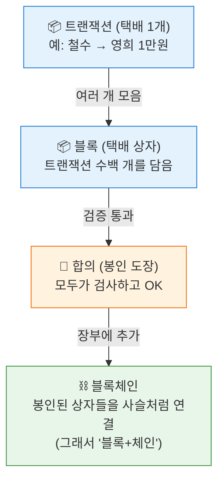

# 📘 Part 1. 블록체인 기반 기술

> **블록체인 기본 지식**을 먼저 깔끔하게 익히고, 각 절 끝의 **`📍 폴리마켓에선`** 한 줄로 "이 기술이 폴리마켓 어디에 쓰이는지"만 짚어요. (개념 흐름을 끊지 않으려고 상세 설명은 Part 2 이후로 미뤘어요.)
> 적용처만 한 번에 몰아 보고 싶으면 맨 끝 **[1-11. 폴리마켓 사용처 지도](#1-11-블록체인-기술--폴리마켓-사용처-지도-)** 로 바로 가도 됩니다. 이미 아는 항목은 건너뛰어도 돼요.

[← 목차로 돌아가기](README.md)

---

## 1-1. 블록체인이란?

**한 줄 정의:** 여러 컴퓨터가 **똑같은 장부(원장)를 나눠 갖고**, 한 번 적힌 기록은 못 고치는 시스템.

### 🏦 비유: 동네 공동 장부
은행은 "내 통장 잔고"를 **은행 서버 한 곳**에만 적어둬요. 은행이 마음먹으면 숫자를 바꿀 수도 있죠.

블록체인은 달라요. 동네 사람 **수천 명이 똑같은 장부를 한 권씩** 들고 있어요.
```
"철수가 영희에게 1만원 보냄"
→ 수천 명이 동시에 자기 장부에 적음
→ 한 명이 몰래 고쳐도, 나머지 수천 권과 안 맞아서 무시당함
```
그래서 **위조가 불가능**하고, **중앙에서 통제하는 주인이 없어요(탈중앙)**.

### 핵심 성질 3가지
| 성질 | 뜻 |
|------|-----|
| **분산(Distributed)** | 장부를 모두가 나눠 가짐 |
| **불변(Immutable)** | 한 번 적히면 못 고침 |
| **투명(Transparent)** | 누구나 기록을 열람 가능 |

> 📍 **폴리마켓에선:** 베팅·정산이 이 "못 고치는 공동 장부"에 적혀, 운영자도 당신 돈을 빼가거나 결과를 조작할 수 없어요.

---

## 1-2. 트랜잭션·블록·합의

**한 줄 정의:** 거래(트랜잭션)들을 모아 상자(블록)에 담고, 모두가 "이 상자 맞아요"라고 동의(합의)하면 장부에 영구 기록.

### 📦 비유: 택배 상자에 차곡차곡


### 합의(Consensus)가 왜 필요해?
주인이 없는데 누가 "이 거래가 진짜다"라고 인정하죠? → **참여자들이 정해진 규칙으로 투표/경쟁**해서 정합니다.

그런데 여기엔 근본적인 난제가 있어요. **"주인 없는 인터넷에서, 서로 모르는 수천 명이 어떻게 하나의 진실에 합의하지?"** 게다가 일부가 거짓말(이중지불, 조작)을 시도할 수도 있죠. 이 문제를 푸는 두 가지 대표 방식이 **PoW**와 **PoS**예요.

---

#### ⚒️ PoW (Proof of Work, 작업증명)

**한 줄 정의:** **"가장 많은 계산 노동을 한 사람"**에게 블록 기록 권한을 주는 방식. 비트코인의 합의 방식.

**🏗️ 비유: 어려운 수학 문제 풀기 대회**
```
1) 전 세계 채굴자(miner)들이 동시에 엄청 어려운 수학 퍼즐을 품
   (사실상 무작위 숫자를 무지막지하게 대입하는 노가다)
2) 가장 먼저 정답을 찾은 사람이 "이번 블록은 내가 기록!" 권한 획득
3) 그 대가로 보상(코인)을 받음 → 이게 '채굴(mining)'
4) 나머지는 "어, 정답 맞네" 확인하고 다음 라운드로
```

**왜 안전한가?**
> 장부를 조작하려면 **전체 채굴자의 51% 이상의 계산 파워**를 혼자 가져야 해요. 그러려면 천문학적인 전기·장비값이 들어서 **"조작보다 정직하게 채굴하는 게 이득"**이 되도록 설계됨. (이걸 **51% 공격** 방어라고 해요)

**단점:**
- ⚡ **전기 낭비 막대함** (퍼즐 푸는 데 어마어마한 전력 소모 — 비트코인이 "환경에 나쁘다"는 비판의 핵심)
- 🐢 **느림** (비트코인은 약 10분에 블록 1개)

---

#### 🪙 PoS (Proof of Stake, 지분증명)

**한 줄 정의:** **"코인을 많이 맡긴(staking) 사람"**에게 블록 기록 권한을 주는 방식. 현재 이더리움의 합의 방식.

**🏦 비유: 보증금 맡긴 심사위원**
```
1) 참여자(검증자, validator)가 코인을 담보로 맡김 (예: 이더리움은 32 ETH)
2) 시스템이 맡긴 사람들 중 한 명을 (지분 비례로) 무작위 선정
3) 선정된 검증자가 블록을 기록하고 보상을 받음
4) 만약 부정행위를 하면? → 맡긴 코인을 몰수당함 (= '슬래싱 slashing')
```

**왜 안전한가?**
> 조작하려면 **엄청난 코인을 맡겨야** 하는데, 부정행위가 들키면 그 코인을 **다 날려요(슬래싱)**. 즉 **"공격하려면 큰돈을 걸어야 하고, 걸린 돈을 잃는다"** → 정직이 이득.

**장점:**
- 🌱 **전기 안 씀** (퍼즐 풀이가 없음 → 이더리움이 PoS로 전환하며 에너지 소비 99.9% 감소)
- ⚡ **빠르고 효율적**

---

#### ⚖️ PoW vs PoS 한눈에 비교

| 구분 | PoW (작업증명) | PoS (지분증명) |
|------|----------------|----------------|
| 권한을 얻는 법 | **계산 노동**(전기) | **코인 담보**(스테이킹) |
| 비유 | 수학 문제 풀기 대회 | 보증금 맡긴 심사위원 |
| 참여자 명칭 | 채굴자(Miner) | 검증자(Validator) |
| 공격 방어 | 51% 계산력 필요 | 51% 지분 필요 + 슬래싱 |
| 에너지 | 막대함 ⚡ | 거의 없음 🌱 |
| 속도 | 느림 🐢 | 빠름 ⚡ |
| 대표 체인 | 비트코인 | 이더리움(현재), **Polygon** |

> 💡 **공통 핵심:** 둘 다 **"조작하려면 큰 비용(전기 or 돈)을 치러야 하고, 정직한 게 이득이 되도록"** 경제적으로 설계됐어요. 이게 [2-G의 UMA 오라클](02-polymarket-mechanics.md#g-3-dvm-투표와-보증금--거짓을-막는-경제-장치)이 보증금으로 정직을 강제하는 것과 **똑같은 원리**예요. 블록체인 전체를 관통하는 사상: **"신뢰를 사람의 선의가 아니라 돈의 논리로 만든다."**

> 📍 **폴리마켓에선:** 당신의 베팅이 트랜잭션 → 블록 → 합의를 거쳐 **Polygon**에 영구 기록돼요. Polygon은 **PoS**라서 빠르고 가스가 싸 — 수많은 소액 베팅을 감당하는 기술적 토대예요.

---

## 1-3. 가스(Gas)와 가스비 ⛽

**한 줄 정의:** 블록체인에 뭔가를 기록·실행시키려면 내는 **수수료**. 컴퓨터를 일 시키는 "기름값".

### 🚗 비유: 자동차 기름값
블록체인을 굴리는 컴퓨터들도 공짜로 일 안 해요. 거래를 처리해주는 대가로 기름값을 받습니다.
```
간단한 거래(송금)        → 기름 조금   → 가스비 쌈
복잡한 거래(스마트컨트랙트) → 기름 많이  → 가스비 비쌈
```

### ⚠️ 헷갈리기 쉬운 핵심: 가스비는 무슨 돈으로 내나?
**그 체인의 "기본 코인(native token)"으로 냅니다. USDC가 아니에요!**
```
이더리움 메인넷 → 가스비를 ETH로 냄    (비쌈)
Polygon        → 가스비를 POL로 냄    (아주 쌈)
```

### 가스비의 본질
> **가스비 = 연산량 + 저장공간에 비례**
> 즉, **"블록체인에 기록하는 양과 횟수"**가 많을수록 비싸짐.

이 한 줄이 **폴리마켓 가스 절약의 모든 비밀**의 뿌리예요. (Part 2-F에서 자세히)

> 📍 **폴리마켓에선:** "기록 최소화 + 싼 체인(Polygon) + 가스 대납"으로 가스비를 거의 0으로 만들어요.

---

## 1-4. 스마트 컨트랙트 📜

**한 줄 정의:** 블록체인 위에 올라간 **"자동으로 실행되는 프로그램(계약)"**. 조건이 맞으면 사람 개입 없이 코드가 알아서 실행됨.

### 🥤 비유: 자판기
자판기는 살아있는 점원이 없어도 작동해요.
```
조건: 1,000원 넣고 콜라 버튼 누름
실행: 자동으로 콜라가 나옴
```
누가 중간에서 "돈만 먹고 콜라 안 줄게" 할 수 없어요. **규칙이 기계(코드)에 박혀 있으니까.**

스마트 컨트랙트도 똑같아요:
```
조건: "비가 왔다"는 결과가 확정됨
실행: 자동으로 "Yes" 토큰 가진 사람에게 $1씩 지급
```

### 핵심 장점
- **신뢰 불필요(Trustless)**: 운영자를 안 믿어도 코드가 보장
- **자동 실행**: 조건 충족 시 사람 없이 작동
- **변조 불가**: 한 번 배포되면 코드를 못 바꿈

> 📍 **폴리마켓에선:** 토큰 발행·거래 정산·결과 지급이 전부 스마트 컨트랙트라, "회사를 믿어서"가 아니라 "코드가 보장해서" 돈을 받아요.

---

## 1-5. 이더리움 vs L2/사이드체인 🛣️

**한 줄 정의:** 이더리움(메인넷)은 안전하지만 비싸고 느림 → 그 위/옆에 **싸고 빠른 보조 도로**를 깔았는데 그게 L2·사이드체인. **Polygon**이 대표적.

### 🛣️ 비유: 고속도로 vs 옆길
```
이더리움 메인넷 = 시내 중심 8차선 고속도로
  - 가장 안전하고 신뢰도 최고
  - 하지만 차가 너무 몰려서 통행료(가스비) 폭등 + 정체

Polygon = 옆에 새로 깐 넓고 한산한 도로
  - 통행료가 1/1000 수준
  - 빠름
  - 대신 메인 고속도로에 "정산 보고"는 함 (안전성 일부 빌림)
```

### 비교표
| | 이더리움 메인넷 | Polygon |
|---|---|---|
| 가스비 | $5 ~ $50 😱 | $0.001 ~ $0.01 😎 |
| 속도 | 느림 | 빠름 |
| 안전성 | 최고 | 높음 (메인넷에 의존) |
| 폴리마켓 | ❌ 안 씀 | ✅ 여기서 운영 |

### 용어 살짝 정리
- **L2(Layer 2)**: 이더리움 "위"에 얹은 확장 레이어 (예: Arbitrum, Optimism, Base)
- **사이드체인(Sidechain)**: 이더리움 "옆"의 독립 체인 (예: Polygon PoS)
- "메인넷보다 싸고 빠른 보조 네트워크"라는 점은 같지만, **보안 모델이 달라요.** ⬇️

---

### 🔍 L2 vs 사이드체인 — 핵심 차이는 딱 하나

> ## **"보안(안전성)을 어디서 가져오는가?"**

| | 보안의 출처 |
|---|---|
| **L2 (Layer 2)** | **이더리움에서 빌려옴** (이더리움이 뒤를 봐줌) |
| **사이드체인** | **자기가 알아서 책임짐** (독립적인 자체 보안) |

#### 🏢 비유: 본사와 지점
이더리움을 **"본사"**라고 해봐요.

**L2 = 본사의 직속 지점 (장부를 본사에 보고)**
```
L2에서 거래 처리 → 거래 내역(증명)을 이더리움에 꼬박꼬박 제출
→ 운영자가 사기 치면? → 이더리움 기록으로 잡아내고 되돌릴 수 있음
→ "이더리움의 신뢰도"를 그대로 물려받음 ✅
```

**사이드체인 = 같은 브랜드를 쓰는 독립 가맹점**
```
사이드체인에서 거래 처리 → 자기 장부에 자기가 기록 (이더리움에 다 보고 안 함)
→ 이더리움과는 브릿지로만 연결
→ 검증자가 사기 치면? → 이더리움은 못 도와줌 ❌
→ "사이드체인 자체 검증자의 신뢰도"에 의존
```

#### ⚖️ 비교표
| 구분 | L2 (Layer 2) | 사이드체인 |
|------|--------------|-----------|
| **보안 출처** | 이더리움에서 상속 ✅ | 자체 검증자가 책임 |
| **이더리움 연결** | 거래 데이터/증명을 메인넷에 제출 | 브릿지로만 연결 |
| **운영자 배신 시** | 메인넷 데이터로 자산 구제 가능 | 구제 어려움 |
| **안전성** | 매우 높음 (이더리움급) | 검증자 집단을 믿는 만큼 |
| **속도/비용** | 빠르고 쌈 | 보통 더 빠르고 더 쌈 |
| **예시** | Arbitrum, Optimism, Base, zkSync | **Polygon PoS**, Gnosis Chain |

> 💡 **트레이드오프:** 사이드체인은 보통 **더 빠르고 더 싸지만**, 그 대가로 보안을 이더리움에 의존하지 않아요. L2는 보안을 빌려오는 대신 약간의 제약/비용이 있죠.

#### ⚠️ 중요: Polygon은 사실 "사이드체인"이에요
폴리마켓이 쓰는 **Polygon PoS는 엄밀히 L2가 아니라 사이드체인**입니다.
```
Polygon PoS = 자체 검증자(PoS)가 보안을 책임지는 사이드체인
  → 주기적으로 "체크포인트"만 이더리움에 제출 (완전 상속은 아님)
  → 그래서 아주 빠르고 가스비가 극도로 쌈
```
> 참고: Polygon은 최근 **zkEVM**이라는 **진짜 L2** 제품도 따로 내놨어요. 그래서 "Polygon"이란 이름 아래 사이드체인(PoS)과 L2(zkEVM)가 **둘 다** 존재해요. 폴리마켓이 오래 써온 건 **PoS 사이드체인** 쪽입니다.

#### 🎯 한 줄 암기
> **L2 = 이더리움 보안을 "상속"받는 확장 레이어**
> **사이드체인 = 이더리움과 "다리로 연결"된 독립 체인 (보안은 스스로)**

> 📍 **폴리마켓에선:** 압도적으로 싼 가스비 때문에 **Polygon**(사이드체인)을 골랐어요. 대가로 자체 검증자 보안에 의존하는 트레이드오프가 있죠.

---

## 1-6. 토큰 표준 (ERC-20 / 721 / 1155) 🪙

**한 줄 정의:** 토큰을 만들 때 따르는 **"규격(표준)"**. 콘센트 규격처럼, 표준을 지키면 모든 지갑·거래소와 호환됨.

### 🔌 비유: 콘센트 규격
모든 전자제품이 같은 콘센트 규격을 쓰니까 아무 데나 꽂혀요. 토큰도 표준을 지키면 메타마스크·거래소 어디서나 인식돼요.

### 3대 표준
| 표준 | 성격 | 비유 | 예시 |
|------|------|------|------|
| **ERC-20** | 똑같은 토큰 (대체 가능) | 지폐 (1만원권은 다 동일) | USDC, 대부분의 코인 |
| **ERC-721** | 다 다른 토큰 (NFT) | 그림 원본 (각자 유일) | 디지털 아트, 수집품 |
| **ERC-1155** | 여러 종류를 한 컨트랙트에서 관리 | 게임 아이템 창고 (검·방패·물약 한 곳에) | 게임 아이템, **폴리마켓 Yes/No** |

### ERC-1155가 폴리마켓에 중요한 이유 ⭐
폴리마켓엔 시장이 수천 개고, 각 시장마다 Yes/No 토큰이 있어요. ERC-1155는 **하나의 컨트랙트에서 수많은 종류의 토큰을 ID로 구분해 관리**할 수 있어요.
```
컨트랙트 1개 안에:
  토큰 ID #1 = "비옴 시장 Yes"
  토큰 ID #2 = "비옴 시장 No"
  토큰 ID #3 = "대선 시장 Yes"
  ... (수천 개)
```
→ 시장마다 컨트랙트를 새로 만들 필요가 없어 **가스 효율적**이고 관리가 쉬워요.

> 📍 **폴리마켓에선:** Yes/No 결과 토큰 = **ERC-1155**, 정산 화폐 USDC = **ERC-20**.

### 📚 공식 규격(EIP/ERC) 원문 링크

> **ERC vs EIP?** 둘 다 이더리움 표준 문서예요. **EIP**(Ethereum Improvement Proposal)는 모든 개선 제안의 통칭이고, 그중 **토큰·계약 표준**에 해당하는 것을 **ERC**(Ethereum Request for Comments)라고 불러요. 즉 "ERC-20"의 정식 문서 번호는 "EIP-20"입니다. (같은 걸 가리킴)

| 표준 | 공식 규격 원문 | 보조 설명 |
|------|----------------|-----------|
| **ERC-20** | [eips.ethereum.org/EIPS/eip-20](https://eips.ethereum.org/EIPS/eip-20) | [ethereum.org 토큰 표준](https://ethereum.org/en/developers/docs/standards/tokens/erc-20/) |
| **ERC-721** | [eips.ethereum.org/EIPS/eip-721](https://eips.ethereum.org/EIPS/eip-721) | [ethereum.org ERC-721](https://ethereum.org/en/developers/docs/standards/tokens/erc-721/) |
| **ERC-1155** | [eips.ethereum.org/EIPS/eip-1155](https://eips.ethereum.org/EIPS/eip-1155) | [ethereum.org ERC-1155](https://ethereum.org/en/developers/docs/standards/tokens/erc-1155/) |

**구현 참고용 (검증된 오픈소스):**
- [OpenZeppelin Contracts](https://docs.openzeppelin.com/contracts/erc20) — 가장 널리 쓰이는 표준 구현 라이브러리 (ERC-20/721/1155 모두 제공)
- [Gnosis Conditional Tokens](https://docs.gnosis.io/conditionaltokens/) — 폴리마켓이 쓰는 ERC-1155 기반 CTF 표준 ([Part 2-B](02-polymarket-mechanics.md#2-b-결과의-토큰화-ctf)에서 자세히)

> 💡 이 문서에서 나오는 다른 표준들의 원문도 함께:
> [EIP-712](https://eips.ethereum.org/EIPS/eip-712)(서명, [1-7](#1-7-지갑·키·서명-)) · [ERC-2771](https://eips.ethereum.org/EIPS/eip-2771)(메타TX) · [EIP-4337](https://eips.ethereum.org/EIPS/eip-4337)(계정 추상화) — [Part 2-F](02-polymarket-mechanics.md#2-f-가스비-절약의-비밀)

---

## 1-7. 지갑·키·서명 ✍️

**한 줄 정의:** 지갑은 "내 자산 계정", 개인키는 "비밀번호 겸 도장", 서명은 "이 거래에 내가 동의함을 도장 찍는 행위".

### 🔑 비유: 도장과 인감
```
개인키(Private Key) = 인감 도장 (절대 남에게 보여주면 안 됨!)
공개키/주소(Address) = 내 계좌번호 (남에게 알려줘도 됨)
서명(Signature)     = 서류에 인감 찍기 ("이 내용에 동의함")
```

### 핵심: "서명"과 "트랜잭션 전송"은 다르다! ⭐
이게 가스리스의 핵심이라 꼭 기억하세요.
```
서명(Sign)        = "이 거래에 동의함" 도장 찍기
                    → 블록체인에 안 올라감 → 가스 0원, 공짜

트랜잭션 전송(Send) = 도장 찍은 서류를 실제로 관공서(체인)에 제출
                    → 블록체인에 기록됨 → 가스 발생
```
> 즉, **서명만 하고 제출은 남이 대신 해줄 수 있어요.** 폴리마켓은 이 점을 이용해 사용자는 서명만, 가스는 폴리마켓이 대신 냅니다.

### EIP-712란?
서명할 때 **사람이 읽을 수 있는 구조화된 형식**으로 보여주는 표준이에요.
```
나쁜 서명: 0x8f3a2b...  (이게 뭔지 알 수 없음 😨)
EIP-712:  "Yes 토큰 10개를 0.5에 매수" (내용이 명확히 보임 😊)
```
→ 사용자가 **뭘 서명하는지 알고** 안전하게 동의할 수 있어요.

> 📍 **폴리마켓에선:** 주문을 EIP-712로 **서명만**(가스 0) 하고, 전송은 릴레이어가 대신 해줘요.

---

## 1-8. 오라클(Oracle) 🔮

**한 줄 정의:** 블록체인은 **바깥세상 정보를 스스로 알 수 없어서**, 외부 사실을 체인 안으로 가져다주는 다리.

### 🌉 비유: 외부 정보를 전해주는 우체부
스마트 컨트랙트는 "자판기" 같은 폐쇄된 기계예요. **창문이 없어서 바깥(날씨, 경기 결과, 주가)을 못 봐요.**
```
컨트랙트: "비가 왔나? 난 알 수가 없어..."
오라클:   "응, 비 왔어! (외부 데이터를 체인에 전달)"
컨트랙트: "OK, 그럼 Yes에 지급!"
```

### 오라클의 딜레마
오라클이 거짓말하면? → 결과가 조작돼요. 그래서 **"오라클을 어떻게 믿을 것인가"**가 핵심 과제예요.
- **중앙화 오라클**: 한 회사가 알려줌 (빠르지만 그 회사를 믿어야 함)
- **탈중앙 오라클**: 여러 명이 검증·투표 (느리지만 신뢰도 높음) → **UMA가 이 방식**

> 📍 **폴리마켓에선:** "결과가 진짜인지" 판정에 **UMA Optimistic Oracle**(탈중앙)을 써요.

---

## 1-9. 스테이블코인 💵

**한 줄 정의:** 가격이 **항상 $1에 고정**되도록 설계된 코인. 변동성 큰 암호화폐 세계의 "현금" 역할.

### 💵 비유: 놀이공원 화폐
```
일반 코인(ETH, BTC) = 주식 (가격이 출렁임)
스테이블코인(USDC)  = 놀이공원 자유이용권 1장 = 항상 $1
```

### USDC는 어떻게 $1을 유지하나?
**예치형(법정화폐 담보)** 방식이에요.
```
USDC 1개 발행될 때마다 → 발행사(Circle)가 진짜 $1을 은행에 보관
→ 언제든 USDC 1개 = 실제 $1로 교환 보장
→ 그래서 가격이 $1에 고정됨
```
(이 외에 암호화폐 담보형(DAI), 알고리즘형 등도 있지만, USDC는 가장 단순한 "실제 달러 보관" 방식)

### 왜 폴리마켓은 USDC를 쓸까?
ETH로 베팅하면 **예측 + 코인가격**이 섞여버려요.
```
Yes를 0.5 ETH에 샀는데 → ETH 폭락 → 예측 맞아도 손해 😵
USDC는 항상 $1 → 순수하게 "예측 적중"만으로 손익 결정 😊
```

> 📍 **폴리마켓에선:** 모든 베팅·정산이 **USDC**라, 코인 가격 걱정 없이 "사건의 확률"에만 집중해요.

---

## 1-10. DeFi·DEX·오더북 📊

**한 줄 정의:** DeFi는 "은행 없는 금융", DEX는 "회사 없는 거래소", 오더북은 "사자/팔자 주문이 쌓인 호가창".

### 🏦 비유 정리
| 용어 | 뜻 | 비유 |
|------|----|----|
| **DeFi** (탈중앙 금융) | 은행·증권사 없이 코드로 돌아가는 금융 | 직원 없는 무인 은행 |
| **DEX** (탈중앙 거래소) | 회사가 운영 안 하는 거래소 | 무인 환전소 |
| **오더북(Order Book)** | 사자·팔자 주문이 가격순으로 쌓인 목록 | 주식 호가창 |

### 오더북이 뭔가? 📋
주식 앱의 호가창과 똑같아요.
```
        팔자(Ask) 주문
  0.72에 100주 팔자
  0.71에 50주 팔자
  ─────────────────  ← 현재가 근처
  0.69에 80주 사자
  0.68에 200주 사자
        사자(Bid) 주문
```
"사자"와 "팔자"가 만나면 **거래 체결**. 폴리마켓도 이 방식이에요.

### 오더북 vs AMM (참고)
탈중앙 거래소엔 두 종류가 있어요:
- **오더북 방식**: 사람들의 주문을 매칭 (폴리마켓, 전통 증권사 스타일)
- **AMM 방식**: 자동 가격 결정 공식(유동성 풀) 사용 (Uniswap 스타일)
- 폴리마켓은 **오더북 방식**(정확히는 하이브리드 — Part 2-E·F)을 씁니다.

> 📍 **폴리마켓에선:** Yes/No를 사고파는 곳이 이 **오더북(CLOB)** — 단 가스 절약을 위해 오프체인에서 운영해요.

---

## 1-11. 블록체인 기술 → 폴리마켓 사용처 지도 🗺️

지금까지 배운 **순수 블록체인 기술**이 폴리마켓 어디에 박혀 있는지 한 번에 모았어요. 각 절의 `📍 폴리마켓에선` 을 표 하나로 합친 거예요. **"기본기 → 적용처"의 다리** 역할입니다.

| 블록체인 기술 (Part 1) | 폴리마켓에서 쓰이는 곳 | 깊이 보기 |
|------------------------|------------------------|-----------|
| **블록체인·불변성** (1-1) | 베팅·정산을 못 고치게 기록 → 운영자 조작 불가 | [2-A](02-polymarket-mechanics.md#2-a-개요) |
| **트랜잭션·블록·합의/PoS** (1-2) | 베팅이 Polygon(PoS)에 영구 기록 | [2-H](02-polymarket-mechanics.md#2-h-자금-입출금) |
| **가스비** (1-3) | 가스 절약 3단 콤보의 출발점 | [2-F](02-polymarket-mechanics.md#2-f-가스비-절약의-비밀) |
| **스마트 컨트랙트** (1-4) | 토큰 발행·정산·결과 지급 자동화 | [2-B](02-polymarket-mechanics.md#2-b-결과의-토큰화-ctf) · [Part 3](03-ctf-exchange.md) |
| **L2/사이드체인** (1-5) | Polygon에서 싸고 빠르게 운영 | [2-F](02-polymarket-mechanics.md#2-f-가스비-절약의-비밀) |
| **ERC-1155 / ERC-20** (1-6) | Yes/No 결과토큰 / USDC 정산화폐 | [2-B](02-polymarket-mechanics.md#2-b-결과의-토큰화-ctf) |
| **지갑·서명·EIP-712** (1-7) | 가스 0 오프체인 주문 서명 | [2-F](02-polymarket-mechanics.md#2-f-가스비-절약의-비밀) · [3-3](03-ctf-exchange.md#3-3-주문order의-구조--eip-712-서명-데이터) |
| **오라클** (1-8) | UMA로 결과 진위 판정 | [2-G](02-polymarket-mechanics.md#2-g-결과-판정-오라클--폴리마켓의-심장-) |
| **스테이블코인 USDC** (1-9) | 모든 베팅·정산의 화폐 | [2-B](02-polymarket-mechanics.md#2-b-결과의-토큰화-ctf) |
| **오더북/DEX** (1-10) | 오프체인 CLOB에서 Yes/No 거래 | [2-E](02-polymarket-mechanics.md#2-e-거래-메커니즘) · [Part 3](03-ctf-exchange.md) |

> 🎯 **한 문장으로:** 폴리마켓은 *싼 체인(Polygon)* 위에서 *스마트 컨트랙트*로 *USDC(ERC-20)*를 *Yes/No 토큰(ERC-1155)*으로 바꿔, *서명(EIP-712)*으로 *오더북(CLOB)* 거래하고, *오라클(UMA)*로 판정하는 시스템이에요. **Part 1의 조각이 전부 여기 모여요.**
> 📒 함수·표준 레벨의 더 자세한 매핑은 [Part 6 치트시트](06-functions-and-standards.md)에 있어요.

---

## ✅ Part 1 요약 체크리스트

여기까지 이해했다면 Part 2로 갈 준비 완료!

| 개념 | 핵심 한 줄 |
|------|-----------|
| **블록체인** | 모두가 나눠 가진 못 고치는 장부 |
| **트랜잭션·블록·합의** | 거래 → 블록 → 합의 → 영구 기록 |
| **가스비** | 기록 비용, 체인의 기본 코인(POL/ETH)으로 냄 |
| **스마트 컨트랙트** | 자동 실행되는 자판기 같은 프로그램 |
| **Polygon** | 이더리움보다 싸고 빠른 보조 도로 |
| **ERC-1155** | 여러 토큰을 한 곳에서 관리 (폴리마켓 Yes/No) |
| **서명 ≠ 트랜잭션** | 서명은 공짜 — 가스리스의 핵심 |
| **오라클** | 바깥세상 정보를 체인에 전해주는 다리 |
| **스테이블코인** | 항상 $1인 디지털 현금 (USDC) |
| **오더북** | 사자/팔자 주문이 쌓인 호가창 |

---

[← 목차로](README.md) | [다음: Part 2 폴리마켓 작동 원리 →](02-polymarket-mechanics.md)
