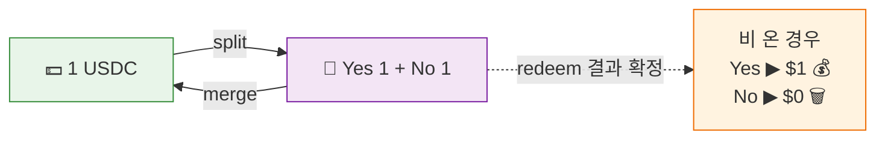
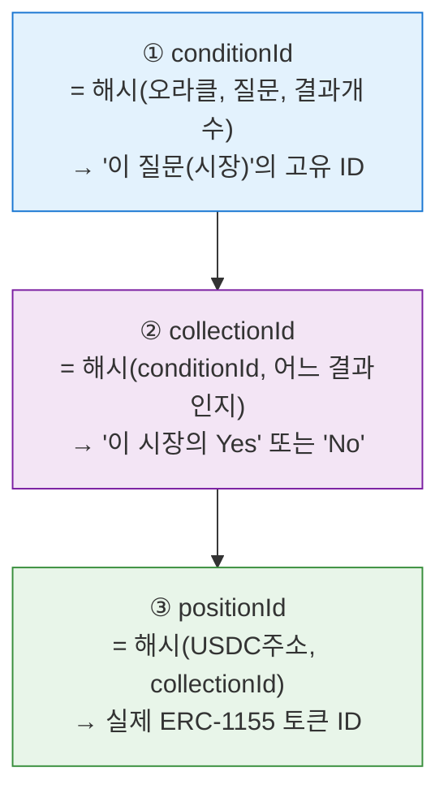
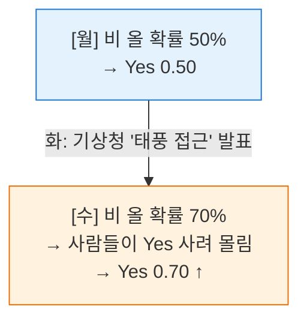
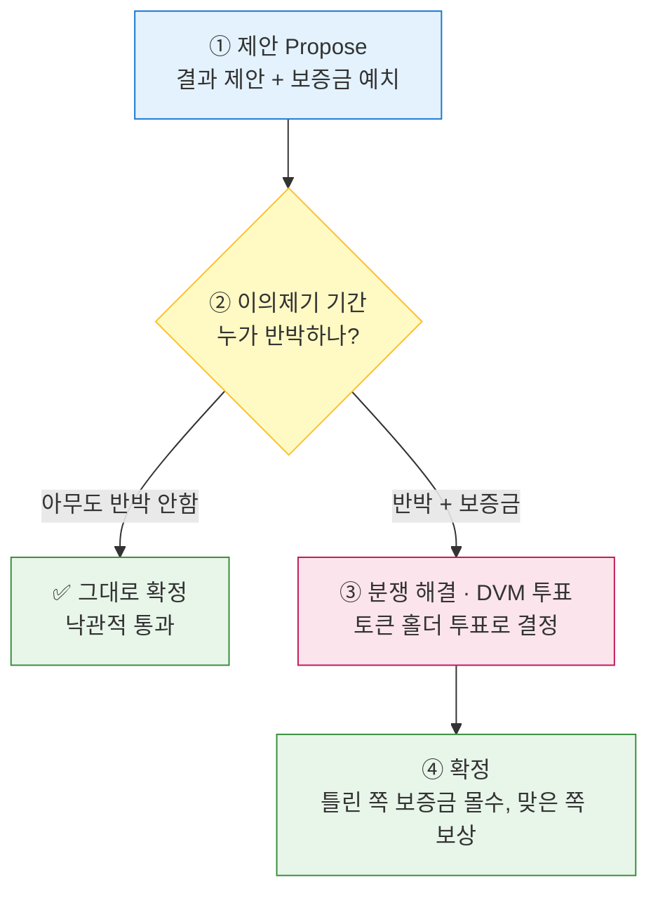
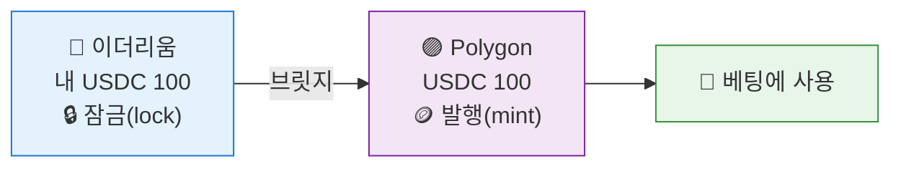

# 📗 Part 2. 폴리마켓 작동 원리

> 실제 **자금 흐름 순서**대로 따라갑니다: **입금 → 토큰화 → 거래 → 판정 → 정산**
> Part 1의 블록체인 기초가 여기서 어떻게 조합되는지 보세요.

[← Part 1로](01-blockchain-basics.md) | [목차](README.md) | [Part 3 거래 계약 →](03-ctf-exchange.md)

---

# 2-A. 개요

## A-1. 예측시장(Prediction Market)이란?

**한 줄 정의:** 미래 사건의 결과를 두고 **"확률"에 베팅**하는 시장. 집단의 예측을 가격으로 모아줌.

### 🎲 비유: 똑똑한 내기판
친구들끼리 "내일 비 올까?" 내기를 한다고 해봐요. 비 온다는 사람이 많을수록 "비 온다" 쪽 판돈이 커지죠. **그 판돈 비율이 곧 사람들이 믿는 확률**이에요.

폴리마켓은 이걸 전 세계 규모로, 진짜 돈으로, 블록체인 위에서 하는 거예요.

### 왜 예측시장이 정확할까?
> **"돈을 걸면 사람은 진심으로 예측한다"**

설문조사는 대충 답해도 손해가 없어요. 하지만 돈을 걸면 **틀리면 잃으니까** 진지하게 분석하죠. 그래서 예측시장은 종종 여론조사보다 정확해요. (이걸 "집단지성"이라고 해요.)

---

## A-2. 폴리마켓 전체 그림 (4개 레이어)

폴리마켓은 4층 건물로 생각하면 깔끔해요.

**위(①)에서 아래(④)로 쌓인 4층 구조**예요:

| 층 | 레이어 | 구성 | 역할 | 다루는 절 |
|----|--------|------|------|-----------|
| **①** | 정산 자산 | USDC (항상 $1인 디지털 달러) | 💵 돈 | 2-B |
| **②** | 결과 토큰화 | CTF (Yes/No = ERC-1155) | 🎫 베팅 티켓 제조 | 2-B, 2-C |
| **③** | 거래 엔진 | 오프체인 오더북 + 온체인 정산 | 🔄 사고팔기(가스절약) | 2-D, 2-E, 2-F |
| **④** | 결과 판정 | UMA Optimistic Oracle | ⚖️ 진실 검증 | 2-G |

이제 한 층씩 내려가 봅시다.

---

# 2-B. 결과의 토큰화 (CTF)

> CTF = **Conditional Tokens Framework** (조건부 토큰 프레임워크). Gnosis가 만든 표준을 폴리마켓이 빌려 씀.
> 이게 폴리마켓에서 **가장 중요한 개념**이에요.

## B-1. 정산 자산은 USDC

모든 베팅과 정산은 **USDC**로 합니다. (왜 USDC인지는 [Part 1-9](01-blockchain-basics.md#1-9-스테이블코인-) 참고)

```
베팅도 USDC → 이기면 USDC로 정산
```

## B-2. Conditional Tokens Framework — split / merge / redeem

CTF는 **"Yes/No 티켓을 만드는 공장"**이에요. 작동 버튼이 3개 있어요.

### 🎫 비유: 놀이공원 티켓 자판기

**① split (쪼개기) — 돈을 티켓으로**
```
1 USDC 투입  →  "비옴 티켓(Yes)" 1장  +  "안옴 티켓(No)" 1장
```
$1을 넣으면 **반드시 Yes 1장 + No 1장 세트**가 나와요. 이 둘을 합치면 항상 $1 가치.

**② merge (합치기) — 티켓을 다시 돈으로**
```
Yes 1장 + No 1장  →  1 USDC 환불
```
세트를 도로 반납하면 $1을 돌려줘요.

**③ redeem (정산) — 결과 확정 후 당첨금 받기**
```
☔ 비 옴 확정  →  Yes 티켓 1장 = $1,  No 티켓 = $0 (휴지조각)
```
이긴 쪽 티켓만 $1로 바꿔줘요.

### 그림으로 정리


## B-3. 핵심 등식: Yes + No = $1 💡

위 split/merge에서 자연스럽게 나오는 **가장 중요한 법칙**:

> ### **Yes 가격 + No 가격 = $1 (항상!)**

왜냐고요? Yes 1장 + No 1장은 언제든 컨트랙트에서 $1로 교환되니까(merge), 그 둘의 가격 합은 $1을 벗어날 수 없어요.

```
Yes 0.70  ←→  No 0.30     ✅ (합 = 1.00)
Yes 0.55  ←→  No 0.45     ✅ (합 = 1.00)
Yes 0.70  ←→  No 0.20     ❌ (합 = 0.90, 불가능!)
```

이 등식이 깨지면 **공짜 돈(차익거래)**이 생기고, 그걸 줍는 사람들 때문에 다시 1로 돌아와요. (자세히는 2-E의 차익거래)

> **그래서 가격 = 확률입니다.** Yes가 0.70이면 "시장은 70% 확률로 본다"는 뜻.

### 🤔 잠깐, 왜 하필 "$1"인가? — 사실은 "담보 1단위"

**"$1"은 마법의 숫자가 아니에요.** 정확히는 **"담보 1단위(1 USDC)"**예요. split이 `1 USDC → Yes 1 + No 1`로 만들어지니, 세트는 항상 **담보 1단위**와 같고, USDC가 $1짜리라서 결과적으로 "$1"로 보이는 거예요.

```
담보가 USDC   → Yes + No = 1 USDC = $1   (지금 폴리마켓)
담보가 1 ETH  → Yes + No = 1 ETH (≠ $1)  (가정)
```

**그럼 왜 "1"로 맞췄나? → 가격을 그대로 확률로 읽으려고.** 상한이 1이면 `Yes 0.70 = 70%`로 바로 읽혀요. 만약 세트가 $10이면 매번 `7.00 ÷ 10`을 해야겠죠. **"1로 정규화"는 의도된 설계**예요.

#### "그럼 이 단위는 안 바뀌나?" — 두 층으로 구분 🔒

| 층 | 내용 | 바뀌나? |
|----|------|---------|
| **① Yes + No = 1 USDC** | split/merge 규칙. [스마트 컨트랙트](01-blockchain-basics.md#1-4-스마트-컨트랙트-)에 고정 | ❌ **절대 안 바뀜** (운영자도 못 바꿈) |
| **② 1 USDC = $1** | USDC의 [페그(peg)](01-blockchain-basics.md#1-9-스테이블코인-) | ⚠️ 보통 고정, **디페그 시 미세하게 흔들림** |

> 즉 **"세트 = 담보 1단위"는 코드가 영원히 보장**하지만, "그 1 USDC가 딱 $1이냐"는 USDC 스테이블코인의 신뢰도에 달린 **한 단계 바깥의 문제**예요. (실제로 2023년 SVB 사태 때 USDC가 잠시 $0.87까지 빠진 적도 있어요. 단, 그때도 컨트랙트엔 여전히 "Yes+No = 1 USDC".)

### 🔬 실제 컨트랙트 코드로 보기

이 등식은 추상적인 약속이 아니라 **실제 스마트 컨트랙트 코드**에 박혀 있어요. 폴리마켓은 [Gnosis의 **Conditional Tokens Framework**](03-ctf-exchange.md)(`ConditionalTokens.sol`)를 Polygon에 배포해서 쓰는데, 핵심은 `splitPosition`(쪼개기)과 `mergePositions`(합치기) 함수예요.

> 📌 Yes/No 시장이면 `outcomeSlotCount = 2`, `partition = [0b01, 0b10]`(=Yes, No)이에요. 아래에서 **"담보 `amount` ↔ 각 결과 토큰 `amount`씩"**이 1:1로 묶이는 지점만 보면 등식의 정체가 보여요.

**① split — 담보 1단위 넣으면 Yes·No를 같은 양씩 발행** (핵심 라인만 발췌)
```solidity
// 담보(USDC) amount를 컨트랙트 금고로 받음
require(
    collateralToken.transferFrom(msg.sender, address(this), amount),
    "could not receive collateral tokens"
);
// ...
// 각 결과 토큰(Yes, No)을 똑같이 'amount'만큼 발행 (amounts[i] = amount)
_batchMint(msg.sender, positionIds, amounts, "");
//          ↑ msg.sender에게  ↑ [Yes ID, No ID]  ↑ [amount, amount]
```
→ **`amount` USDC 입금 = Yes `amount`개 + No `amount`개.** 그래서 세트 1개 = 담보 1단위.

**② merge — Yes·No 세트를 소각하면 담보 1단위 환불** (핵심 라인만 발췌)
```solidity
// 결과 토큰 세트(Yes+No)를 소각
_batchBurn(msg.sender, positionIds, amounts);
// ...
// 담보(USDC) amount를 그대로 돌려줌
require(
    collateralToken.transfer(msg.sender, amount),
    "could not send collateral tokens"
);
```
→ **Yes `amount` + No `amount` 반납 = `amount` USDC.** 정확히 split의 역방향.

> 💡 이 `transferFrom(amount)` ↔ `_batchMint(amounts)`의 **1:1 대응**이 바로 "Yes + No = 1 담보단위"를 코드 레벨에서 강제하는 부분이에요. 운영자가 못 바꾸는 이유([스마트 컨트랙트 불변성](01-blockchain-basics.md#1-4-스마트-컨트랙트-))가 여기 있어요.

<details>
<summary>📜 <b>splitPosition / mergePositions 전체 원본 코드 보기</b> (클릭) — 출처: gnosis/conditional-tokens-contracts</summary>

> ⚠️ 아래는 [gnosis/conditional-tokens-contracts](https://github.com/gnosis/conditional-tokens-contracts/blob/master/contracts/ConditionalTokens.sol)의 실제 코드입니다. 다중 결과·부분 분할(부모 컬렉션)까지 일반화돼 있어 복잡해 보이지만, **Yes/No 시장은 위 발췌 부분(full set 분기)만 타요.**

```solidity
/// @dev This function splits a position. If splitting from the collateral, this contract
///      will attempt to transfer `amount` collateral from the message sender to itself.
///      Otherwise, this contract will burn `amount` stake held by the message sender in the
///      position being split worth of EIP 1155 tokens. Regardless, if successful, `amount`
///      stake will be minted in the split target positions.
function splitPosition(
    IERC20 collateralToken,
    bytes32 parentCollectionId,
    bytes32 conditionId,
    uint[] calldata partition,
    uint amount
) external {
    require(partition.length > 1, "got empty or singleton partition");
    uint outcomeSlotCount = payoutNumerators[conditionId].length;
    require(outcomeSlotCount > 0, "condition not prepared yet");

    // For a condition with 4 outcomes fullIndexSet's 0b1111; for 5 it's 0b11111...
    uint fullIndexSet = (1 << outcomeSlotCount) - 1;
    uint freeIndexSet = fullIndexSet;
    uint[] memory positionIds = new uint[](partition.length);
    uint[] memory amounts = new uint[](partition.length);
    for (uint i = 0; i < partition.length; i++) {
        uint indexSet = partition[i];
        require(indexSet > 0 && indexSet < fullIndexSet, "got invalid index set");
        require((indexSet & freeIndexSet) == indexSet, "partition not disjoint");
        freeIndexSet ^= indexSet;
        positionIds[i] = CTHelpers.getPositionId(collateralToken, CTHelpers.getCollectionId(parentCollectionId, conditionId, indexSet));
        amounts[i] = amount;
    }

    if (freeIndexSet == 0) {
        // Partitioning the full set of outcomes for the condition in this branch
        if (parentCollectionId == bytes32(0)) {
            require(collateralToken.transferFrom(msg.sender, address(this), amount), "could not receive collateral tokens");
        } else {
            _burn(
                msg.sender,
                CTHelpers.getPositionId(collateralToken, parentCollectionId),
                amount
            );
        }
    } else {
        // Partitioning a subset of outcomes for the condition in this branch.
        _burn(
            msg.sender,
            CTHelpers.getPositionId(collateralToken,
                CTHelpers.getCollectionId(parentCollectionId, conditionId, fullIndexSet ^ freeIndexSet)),
            amount
        );
    }

    _batchMint(
        msg.sender,
        positionIds, // position ID is the ERC 1155 token ID
        amounts,
        ""
    );
    emit PositionSplit(msg.sender, collateralToken, parentCollectionId, conditionId, partition, amount);
}

function mergePositions(
    IERC20 collateralToken,
    bytes32 parentCollectionId,
    bytes32 conditionId,
    uint[] calldata partition,
    uint amount
) external {
    require(partition.length > 1, "got empty or singleton partition");
    uint outcomeSlotCount = payoutNumerators[conditionId].length;
    require(outcomeSlotCount > 0, "condition not prepared yet");

    uint fullIndexSet = (1 << outcomeSlotCount) - 1;
    uint freeIndexSet = fullIndexSet;
    uint[] memory positionIds = new uint[](partition.length);
    uint[] memory amounts = new uint[](partition.length);
    for (uint i = 0; i < partition.length; i++) {
        uint indexSet = partition[i];
        require(indexSet > 0 && indexSet < fullIndexSet, "got invalid index set");
        require((indexSet & freeIndexSet) == indexSet, "partition not disjoint");
        freeIndexSet ^= indexSet;
        positionIds[i] = CTHelpers.getPositionId(collateralToken, CTHelpers.getCollectionId(parentCollectionId, conditionId, indexSet));
        amounts[i] = amount;
    }
    _batchBurn(
        msg.sender,
        positionIds,
        amounts
    );

    if (freeIndexSet == 0) {
        if (parentCollectionId == bytes32(0)) {
            require(collateralToken.transfer(msg.sender, amount), "could not send collateral tokens");
        } else {
            _mint(
                msg.sender,
                CTHelpers.getPositionId(collateralToken, parentCollectionId),
                amount,
                ""
            );
        }
    } else {
        _mint(
            msg.sender,
            CTHelpers.getPositionId(collateralToken,
                CTHelpers.getCollectionId(parentCollectionId, conditionId, fullIndexSet ^ freeIndexSet)),
            amount,
            ""
        );
    }

    emit PositionsMerge(msg.sender, collateralToken, parentCollectionId, conditionId, partition, amount);
}

// 정산: 결과 확정 후 이긴 토큰을 담보로 교환
function redeemPositions(IERC20 collateralToken, bytes32 parentCollectionId, bytes32 conditionId, uint[] calldata indexSets) external;
```

**출처:** [gnosis/conditional-tokens-contracts · ConditionalTokens.sol](https://github.com/gnosis/conditional-tokens-contracts/blob/master/contracts/ConditionalTokens.sol) (버전에 따라 다를 수 있으니 최신본 확인)

</details>

## B-4. 토큰 ID 내부구조 (조금 기술적) 🔢

> 이 절은 어려우면 건너뛰어도 OK. "토큰 ID가 어떻게 정해지나"가 궁금한 분만.

Yes/No 토큰의 ID는 **수학적으로 계산되어 미리 정해져** 있어요. 3단계로 만들어집니다.



### 🏠 비유: 주소 체계
```
conditionId  = "서울시 강남구" (시장 전체)
collectionId = "강남구 ○○아파트 101동" (Yes동 / No동)
positionId   = "101동 1503호" (실제 토큰)
```
주소(ID)는 건물을 짓기 전에도 정해져 있어요. **split을 해야 그 호수에 사람(잔고)이 입주**하는 거죠. (다음 2-C에서 이어집니다)

---

# 2-C. 시장과 토큰의 탄생

> "최초 토큰은 어떻게 생겨?"에 대한 답. **토큰은 미리 찍어두는 게 아니라, USDC가 들어올 때 즉석에서 민팅**돼요.

## C-1. 시장 생성 — prepareCondition (설계도 등록)

먼저 누군가 **질문(시장)을 컨트랙트에 등록**해요.

```
prepareCondition(
    oracle,            // 결과 판정자 (UMA)
    questionId,        // "내일 비 올까?"
    outcomeSlotCount   // 결과 개수 = 2 (Yes/No)
)
```

### 🍞 비유: 빵틀만 만들기
이때 **토큰은 안 만들어져요.** "이런 질문이 있고 결과는 2개다"라는 **규칙(설계도)만 등록**. 빵을 굽기 전 **빵틀만 짜둔 상태**예요. 결과물(`conditionId`)은 이 시장의 고유 ID.

## C-2. 최초 토큰 생성 — splitPosition

이제 누군가 **USDC를 맡기는 순간**, 진짜 토큰이 처음 찍혀 나와요.

```
누군가 100 USDC 입금 → splitPosition
─────────────────────────────────────
결과: Yes 토큰 100개 + No 토큰 100개 첫 탄생! 🎉
      (100 USDC는 컨트랙트 금고에 잠김)
```

### 여기서 두 가지 진실 ⭐
**① 토큰은 담보(USDC)만큼만 존재**
```
금고에 잠긴 USDC 100  ⟺  세상에 존재하는 (Yes 또는 No) 세트 100
```
허공에서 생기지 않아요. **모든 토큰은 진짜 USDC로 100% 뒷받침**됩니다. 그래서 이긴 사람에게 줄 $1이 항상 보장돼요.

**② 토큰 ID는 이미 정해져 있고, 잔고만 0 → 채워짐**
은행 계좌번호는 정해져 있는데 잔고가 0이었다가, 입금하면 채워지는 것과 같아요.

## C-3. 마켓 메이커와 초기 유동성 — 왜 0.5/0.5로 시작하나

그럼 **누가 최초로 split을 할까?** → 보통 **마켓 메이커(Market Maker)**가 초기 물량을 공급해요.

```
마켓 메이커가:
1) USDC 10,000을 split → Yes 10,000 + No 10,000 확보
2) 오더북에 양쪽 다 매도 주문:
      "Yes 0.50에 팝니다"
      "No  0.50에 팝니다"
```

### 왜 0.5 / 0.5에서 시작?
처음엔 정보가 없어서 **"50:50, 반반"**으로 보는 게 공정해요.
```
시작: Yes 0.50 / No 0.50  (아무도 모름, 동전 던지기)
  ↓ 뉴스/정보가 쌓이면서
변화: Yes 0.70 / No 0.30  (비 올 가능성 높아짐)
```

> 💡 **"최초 토큰" = 마켓 메이커가 USDC를 split해서 만든 것.** 일반 사용자는 그걸 오더북에서 사는 거예요.

### 💰 마켓 메이커는 어떻게 버나? — 베팅 말고 "장사"

시장을 열고 예치(split)한 사람은 **결과에 베팅하는 게 아니라, 유동성을 공급하고 수익**을 내요. (3가지 + 리스크)

**① 스프레드 수익 — 결과와 무관 ⭐**
```
USDC 1000 split → Yes 1000 + No 1000
호가창: Yes 팔자 @ 0.52 / No 팔자 @ 0.50  → 한 세트 팔면 1.02 회수
세트 원가 1.00  →  세트당 +0.02 마진 (비가 오든 말든 무관!)
```
> 🔑 Yes·No를 **둘 다 팔면** "베팅"이 아니라 **"세트 장사"**. 환전소가 살 때/팔 때 환율차로 버는 것과 같아요.

**② 유동성 보상(Liquidity Rewards)** — 폴리마켓이 호가창 근처에 물량을 깐 LP에게 인센티브 지급. 거래가 안 나도 "물량 제공"만으로 보상.

**③ (AMM형 시장이면) 거래 수수료** — 풀에 예치한 LP가 모든 거래에서 수수료 수취. (폴리마켓 CLOB에선 약하지만 예측시장 일반에선 흔함)

> ⚠️ **공짜는 아님 — 리스크가 대가:**
> | 리스크 | 설명 |
> |--------|------|
> | **역선택** | 정보 있는 쪽이 한쪽만 쓸어가면 지는 인벤토리만 떠안음 |
> | **가격 급변** | 한 방향 쏠리면 싸게 판 토큰이 비싸짐 → 손해 |
> | **재고 위험** | 안 팔린 한쪽이 $0로 정산될 수 있음 |
>
> 스프레드(+0.02)는 이 위험을 감수하는 **대가**. 전문 MM·봇이 잘하는 이유. ([Part 2-E5 유동성](#e-5-유동성과-슬리피지--못-팔-수도-있나-) 연결)

---

# 2-D. 가격 = 확률

## D-1. 가격이 곧 확률인 이유

[B-3](#b-3-핵심-등식-yes--no--1-)에서 봤듯 **Yes + No = $1**이라서, 각 가격이 자연스럽게 확률이 돼요.

| 내가 산 가격 | 시장의 시각 | 맞으면 받는 돈 | 수익률 |
|---|---|---|---|
| Yes **0.70** | "70% 확률" | $1.00 | +43% |
| Yes **0.50** | "반반" | $1.00 | +100% |
| Yes **0.20** | "20%, 가능성 낮음" | $1.00 | +400% 😮 |

> **싸게 살수록 = 시장이 가능성을 낮게 봄 = 맞으면 대박, 틀리면 0원**
> **비싸게 살수록 = 거의 확실 = 맞아도 적게 벌고 안전**

## D-2. 가격이 움직이는 메커니즘 📈

가격은 **뉴스·상황 변화 → 확률 인식 변화 → 사자/팔자 압력 변화**로 움직여요.



### 🌡️ 비유: 온도계
가격은 **"시장의 확신 온도계"**예요. 좋은 소식 → 온도(가격) 상승, 나쁜 소식 → 하락. 당신이 남보다 먼저 정보를 잡으면, 싸게 사서 비싸게 팔 수 있어요. (다음 2-E)

---

# 2-E. 거래 메커니즘

> 여기가 실전. **오더북에서 어떻게 사고파는가**.

## E-1. 오더북과 메이커/테이커

폴리마켓 거래소(CLOB)는 주식 호가창과 똑같아요. 참여자는 두 종류:

| 역할 | 뜻 | 비유 |
|------|----|----|
| **메이커(Maker)** | 주문을 걸어두고 기다림 ("0.65에 살래") | 중고장터에 물건 올려두고 기다리는 사람 |
| **테이커(Taker)** | 이미 걸린 주문을 즉시 잡음 | 올라온 물건을 바로 사가는 사람 |

```
메이커: "Yes 0.65에 살래" (호가창에 등록, 대기)
테이커: "그 0.65 주문 내가 받을게!" → 즉시 체결
```

## E-2. 지정가 vs 시장가 주문

가격을 정하는 방법 2가지:

```
① 지정가(Limit)  "Yes를 0.65에 사겠다" → 그 가격에 팔 사람 나타나야 체결
                 (안 나타나면 대기, 가스 0)
② 시장가(Market) "지금 당장 사겠다"     → 현재 호가(예: 0.70)에 즉시 체결
```

> 가격은 **내가 정할 수 있지만(지정가), 거래 상대가 있어야** 실제로 체결돼요.

## E-3. 단타 매매 — 0.5에 사서 0.7에 팔기 ⭐

**중요:** 결과를 끝까지 기다릴 필요가 없어요! **주식 단타처럼** 중간에 되팔 수 있어요.

```
[월] Yes 10주 @ 0.50 매수  →  -$5.00
[수] 태풍 접근 뉴스 → Yes 가격 0.70 상승
     Yes 10주 @ 0.70 매도  →  +$7.00
─────────────────────────────────────
결과: 비가 오든 말든 → +$2.00 확정 💰
```

돈 버는 방법은 **2가지**:
| 방법 | 설명 |
|------|------|
| **① 끝까지 보유** | 결과 맞으면 $1 정산 (예측 자신 있을 때) |
| **② 중간에 단타** | 가격 오르면 되팔아 차익 (변동만 노릴 때) |

## E-4. 숏(Short) — 하락에 베팅하는 법

"이 사건은 **안 일어날 것 같다**"에 베팅하려면? → **No를 사면 돼요.** 그게 곧 "하락 베팅"이에요.

```
"비 안 온다"에 베팅  =  No 매수
  → 비 안 오면 No가 $1로 정산 → 수익
```

또는 가진 Yes 토큰을 팔아도 됩니다(보유분 청산). 주식의 공매도처럼 복잡한 빌려오기 없이, **반대편 토큰(No)을 사는 것**으로 간단히 하락에 베팅해요.

## E-5. 유동성과 슬리피지 — 못 팔 수도 있나? 💧

**유동성(Liquidity)** = 시장에 깔린 주문(물량)의 두께.

```
유동성 풍부 (인기 시장)  → 원하는 가격에 바로 사고팔기 쉬움 😊
유동성 부족 (비인기 시장) → 팔고 싶어도 살 사람이 없을 수 있음 😟
```

### 슬리피지(Slippage)란?
물량이 얇으면 **큰 주문이 가격을 밀어버려요.**
```
Yes를 1000주 팔려는데:
  0.70에 사겠다는 사람 100주
  0.68에 사겠다는 사람 200주
  0.65에 사겠다는 사람 300주 ...
→ 다 팔려면 평균 0.66밖에 못 받음 (0.70 기대 → 0.66 체결)
→ 이 가격 미끄러짐 = 슬리피지
```

> 그래서 **인기 없는 시장은 "못 팔 수도" 있고, 큰돈은 불리하게 팔릴 수 있어요.** 마켓 메이커가 유동성을 공급하는 이유가 이걸 완화하기 위해서예요.

## E-6. 차익거래(Arbitrage) — Yes+No=1을 지키는 힘 ⚖️

> 일반 사용자는 **하나만** 사요(베팅). 차익거래는 **가격이 깨졌을 때 둘 다 사는** 특수 기술이에요.

### 합이 1보다 작을 때 (합 < 1)
```
오더북: Yes 0.60 팔자 / No 0.30 팔자  (합 0.90, 비정상!)

차익거래자:
1) Yes 1주 매수 (-$0.60)
2) No  1주 매수 (-$0.30)   → 합 $0.90 지불
3) merge로 Yes+No → $1.00 환불
결과: $0.90 내고 $1.00 받음 → 무위험 +$0.10 💰
```
**결과를 기다릴 필요 없어요.** 세트는 즉시 $1로 merge되니까. 위험 0, 이익 확정.

### 합이 1보다 클 때 (합 > 1)
```
오더북: Yes 0.70 사자 / No 0.50 사자  (합 1.20, 비정상!)

차익거래자:
1) USDC $1로 split → Yes 1 + No 1 생성 (-$1.00)
2) Yes 0.70에 매도, No 0.50에 매도 → +$1.20
결과: $1 들여 $1.20 회수 → 무위험 +$0.20 💰
```

### 그래서 가격이 1로 수렴
이런 공짜 돈이 보이면 봇들이 달려들어 → 가격이 밀려 **합이 자동으로 1.00에 맞춰져요.** 시장이 알아서 균형을 잡는 거죠.

| 구분 | 누가 | Yes/No | 위험 |
|------|------|--------|------|
| 일반 베팅 | 보통 사용자 | **하나만** | 있음 |
| 차익거래(합<1) | 봇/전문가 | 둘 다 매수→merge | 없음 |
| 차익거래(합>1) | 봇/전문가 | split→둘 다 매도 | 없음 |

## E-7. 다중 결과 시장 — 후보가 여러 명일 때

"누가 대통령이 될까? (후보 A/B/C/D/E)"처럼 **결과가 2개 초과**인 시장도 있어요.

```
prepareCondition의 outcomeSlotCount = 5
→ 토큰 5종: A토큰, B토큰, C토큰, D토큰, E토큰
```

### 핵심 등식 확장
```
2개 시장: Yes + No = $1
N개 시장: A + B + C + D + E = $1
```
모든 결과 토큰 가격의 **합은 여전히 $1**. 각 가격이 그 후보의 당선 확률이에요.
```
A 0.45 (45%) + B 0.30 + C 0.15 + D 0.07 + E 0.03 = 1.00
```
이긴 후보 토큰만 $1, 나머지는 $0로 정산.

---

# 2-F. 가스비 절약의 비밀

> "토큰으로 가스 없이 한다"의 진짜 정체. **3단 콤보**예요.
> 핵심 원리: [Part 1-3](01-blockchain-basics.md#1-3-가스gas와-가스비-)의 **"가스 = 기록하는 양·횟수"**를 기억하세요.

## F-1. 콤보① — Polygon에서 실행

```
같은 거래:
  이더리움 메인넷: $5 ~ $50 가스 😱
  Polygon:        $0.001 ~ $0.01 😎  (수천 배 저렴)
```
싼 동네에서 노는 것만으로 1차 절약.

## F-2. 콤보② — 오프체인 오더북 (체결 전엔 가스 0)

가스는 "체인에 기록할 때"만 들어요. 폴리마켓은 거래 대부분을 **체인 밖(오프체인)**에서 처리해요.

| 처리 위치 | 무엇을 | 가스 |
|-----------|--------|------|
| **🟢 오프체인** (체인 밖) | 주문 생성 → 서명만, 기록 X | **0원** |
| **🟢 오프체인** | 주문 취소 → 기록 X | **0원** |
| **🟢 오프체인** | 호가 매칭 → 폴리마켓 서버가 처리 | **0원** |
| ⬇️ *체결된 거래만 아래로* | | |
| **🔴 온체인** (체인 기록) | 실제 토큰 교환만 Polygon에 기록 | 발생 (Polygon이라 푼돈) |

> 주식 앱에서 주문 100번 넣고 취소해도 수수료 안 떼이듯, **체결 전까지 가스 0**.

## F-3. 콤보③ — 가스리스(Gasless): 서명 + 릴레이어 대납 ⭐

"토큰(POL) 없이도 거래된다"의 정체. **메타 트랜잭션** 기술.

```
보통: 내가 직접 트랜잭션 전송 → 내가 POL 가스 냄 😓

폴리마켓:
1) 나는 "이 주문 동의함" EIP-712 서명만 함  (가스 0)
2) 폴리마켓 릴레이어(relayer)가 그 서명을 받아
3) 대신 트랜잭션 전송 + POL 가스 대납
────────────────────────────────────────
→ 나는 POL이 0이어도 USDC만 있으면 거래 가능! 💸
```

[Part 1-7](01-blockchain-basics.md#1-7-지갑·키·서명-)에서 본 **"서명 ≠ 트랜잭션 전송"**이 여기서 빛을 발해요.
```
서명    = 도장 찍기 (공짜) → 사용자가 함
트랜잭션 = 관공서 제출 (가스) → 폴리마켓이 대신 함
```

## F-4. 메타 트랜잭션·프록시 월렛 (기술 디테일)

- **메타 트랜잭션 표준**: `ERC-2771`(신뢰된 포워더), 최신은 `EIP-4337`(계정 추상화)
- **프록시 월렛(Proxy Wallet)**: 사용자마다 스마트 컨트랙트 지갑을 만들어, 승인·거래를 묶어 처리 → 릴레이어가 대신 실행하기 쉬워짐

## F-5. 배치 정산 — 단건을 묶어 가스 줄이기 📦

"체결이 많으면 트랜잭션도 많아져 가스가 쌓이는데?" → **여러 체결을 한 트랜잭션에 묶어서(배치)** 해결해요.

### 왜 묶으면 싸지나? — "기본비"를 한 번만
모든 트랜잭션은 내용과 무관한 **고정 기본 비용(base cost)**이 붙어요 (폴리곤도 동일).
```
따로따로:  [기본비+체결A] [기본비+체결B] [기본비+체결C]  → 기본비 3번 💸💸💸
묶어서:    [기본비 + 체결A+B+C]                          → 기본비 1번 💸
```
> 🚚 비유: 택배를 3번 따로 부치면 배송비 3번, **한 상자에 담아 1번** 부치면 배송비 1번.

### 어떻게 묶나? — `matchOrders` (테이커 1 ↔ 메이커 여러 명)
CTF Exchange엔 **테이커 1명의 주문을 여러 메이커 주문과 한꺼번에 체결**하는 함수가 있어요.
```
큰 매수자(테이커): "Yes 1000개 살래"
호가북엔 작은 매도 주문이 흩어져 있음:
   메이커 A: 300개 @ 0.70
   메이커 B: 400개 @ 0.71
   메이커 C: 300개 @ 0.72

오퍼레이터(서버):
   matchOrders(테이커주문, [A, B, C], ...)   ← 한 번의 트랜잭션!
   → 컨트랙트가 내부에서 A·B·C를 순회하며 각각 정산
   → 가스 기본비는 1번만 발생
```
- **`matchOrders`** = 테이커 1 ↔ 메이커 N (한 큰 주문을 여러 주문으로 잘게 채움)
- **`fillOrders`** = 독립된 여러 주문을 한 번에 처리

> 🤖 **묶는 주체 = 오퍼레이터(폴리마켓 서버).** 오프체인 매칭엔진이 "이 테이커는 A·B·C로 채울 수 있다"를 계산해서, 그 묶음을 **한 트랜잭션으로** 컨트랙트에 제출해요. (사용자는 각자 자기 주문만 서명할 뿐, 묶는 건 서버가 함)

### ⚠️ 한계 — 배치는 "테이커 단위"라 만능이 아님
**가장 중요한 한계:** `matchOrders`는 **한 테이커 주문**을 여러 메이커와 묶는 거예요. 서로 다른 테이커의 거래는 **각자 트랜잭션**입니다.

| 상황 | 배치 효과 |
|------|-----------|
| 테이커 1명 ↔ 메이커 **여러 명** (큰 주문이 호가북을 쓸어담음) | ✅ N건 → 1트랜잭션 **(이득)** |
| 테이커 1명 ↔ 메이커 **1명** (소액 1:1 체결) | ❌ 어차피 1트랜잭션 = **건별 (배치 무의미)** |
| 테이커 **여러 명**이 각자 매수 | ❌ 사람마다 트랜잭션 따로 |

```
"Yes 1000개 살래" + 흩어진 매도 5개 → matchOrders 1번 (5건→1건, 이득)
"Yes 10개 살래"  + 매도 1개         → 그냥 1건 (배치할 게 없음 = 건별)
```
- 한 트랜잭션이 너무 커지면 **블록 가스 한도**도 넘어요 → 무한정 못 묶음.

> 🎯 **그래서 배치는 "주연"이 아니라 "조연"이에요.** "큰 주문 1개가 여러 물량을 쓸어담을 때"만 빛나고, 소액 1:1 거래는 그냥 건별이에요. **진짜 가스 절약의 무게중심은 여전히 F-1~F-3 (체결만 온체인 + 싼 폴리곤 + 대납)**이고, 배치(F-5)는 큰 주문에서 추가로 아끼는 보너스예요. 🎁

> 🔗 실제 함수는 [Part 3 CTF Exchange](03-ctf-exchange.md)에 있어요. [정산 3방식(NORMAL/MINT/MERGE)](03-ctf-exchange.md#3-5-정산의-3가지-방식--가장-중요)도 이렇게 배치로 처리돼요.

### ⚠️ "절약"이지 "공짜"는 아님
가스가 사라지는 게 아니라 **누군가(폴리마켓)가 대신 낼 뿐**이에요. 폴리마켓은 그 비용을 운영/수수료 차원에서 감당해요(2-I).

### 한 줄 원리
> **"가스 절약 = 체인에 기록하는 횟수·양을 줄이고, 싼 체인에서, 남이 대신 낸다"**

| 전략 | 방법 |
|------|------|
| 싼 체인 | Polygon (F-1) |
| 체인 밖 처리 | 오프체인 오더북 (F-2) |
| 가스 대납 | 릴레이어 + EIP-712 (F-3) |
| 묶어서 처리 | 배치 정산 `matchOrders` (F-5) |

---

# 2-G. 결과 판정 (오라클) — 폴리마켓의 심장 ⚖️

> "비가 진짜 왔는지 누가 정하나?" 이게 예측시장 신뢰의 핵심이에요.
> 폴리마켓은 **UMA의 Optimistic Oracle**을 씁니다. ([Part 1-8](01-blockchain-basics.md#1-8-오라클oracle-) 참고)

## G-1. UMA Optimistic Oracle 개요

**Optimistic = "낙관적".** 무슨 뜻이냐면:
> **"대부분의 결과는 명백하니, 일단 믿자. 누가 반박할 때만 비싸게 검증하자."**

매번 전 세계 투표를 하면 느리고 비싸요. 그래서 **분쟁이 없으면 그냥 통과**시키는 효율적 방식이에요.

## G-2. 흐름 — 제안 → 이의제기 → 확정



### 🏛️ 비유: 동네 게시판 + 법원
```
제안     = 게시판에 "비 왔음" 공고 붙이기 (보증금 = 신뢰의 증표)
이의제기 = 며칠간 아무도 반박 안 하면 → 사실로 인정
분쟁     = 누가 반박하면 → 법원(DVM 투표)으로 가서 판결
```

## G-3. DVM 투표와 보증금 — 거짓을 막는 경제 장치

**DVM(Data Verification Mechanism)** = UMA의 "법원". 토큰 홀더들이 투표.

핵심은 **돈으로 정직을 강제**하는 구조예요:
```
거짓 제안 → 반박당해 패소 → 보증금 몰수 (손해 💸)
정직 제안 → 분쟁 없거나 승소 → 보증금 회수 + 보상

→ 거짓말하면 돈을 잃으니까, 정직하게 행동하는 게 이득
```

> 이걸 **"경제적 인센티브로 진실을 보장한다"**고 해요. 사람의 선의가 아니라 **돈의 논리**로 신뢰를 만드는 거죠.

## G-4. 애매한 결과 처리

경기 취소, 무승부, 질문이 모호한 경우는?
```
- "50:50으로 분할 정산" (Yes/No 각 $0.50씩)
- 또는 "판정 불가" 같은 특수 결과값 사용
```
시장을 만들 때 **"이런 경우엔 이렇게 정산한다"는 규칙(resolution criteria)**을 미리 정해둬요. 그래서 애매해도 다툼을 줄여요.

---

# 2-H. 자금 입출금

## H-1. 브릿지(Bridge) — 이더리움 자산을 Polygon으로 🌉

폴리마켓은 Polygon에서 도는데, 내 돈이 이더리움에 있다면? → **브릿지**로 옮겨요.

### 🌉 비유: 환전소 겸 다리

브릿지는 **"한쪽 체인에서 잠그고, 다른 쪽 체인에서 같은 만큼 발행"**하는 방식으로 자산을 옮겨요. 즉, **이더리움에서 USDC 100을 잠그면(lock) → Polygon에서 같은 100이 발행(mint)**돼요. 실제로 코인이 물리적으로 이동한 건 아니지만, 결과적으로 Polygon에서 쓸 수 있게 되는 거예요.

## H-2. 입금·출금 과정

폴리마켓은 이 과정을 **자동화**해줘요:
```
입금: 이더리움 USDC / ETH / 카드 등 → 자동 변환·브릿지 → Polygon USDC
출금: Polygon USDC → 브릿지 → 원하는 체인으로 / 현금화
```
사용자는 복잡한 브릿지 과정을 몰라도 "입금" 버튼만 누르면 돼요.

---

# 2-I. 비즈니스·맥락

## I-1. 수익 모델 — 수수료 0% 전략 + 예치금 이자 💰

### 반전: 거래 수수료가 오랫동안 0%였다
```
보통 거래소: 거래마다 0.1~0.5% 수수료
폴리마켓:    오랫동안 거래 수수료 0%  ← 일부러!
```
**왜?** → 수수료 0 → 사람 몰림 → 유동성 폭발 → 시장 장악. (우버·쿠팡의 초기 적자 전략과 같음)

### 그럼 어떻게 버나?
| 수익원 | 설명 |
|--------|------|
| **① 예치금 이자 ★** | 금고에 잠긴 수십억 USDC를 국채 등에 굴려 이자 수익 |
| **② VC 투자금** | 거액 투자받아 점유율부터 키움 |
| **③ 미래 수수료·데이터** | 시장 장악 후 수수료 도입, 예측 데이터 판매, API |
| **④ 스프레드** | 마켓 메이킹의 사자/팔자 가격차 |

> **핵심:** "수수료 장사"라기보다 **"점유율 먼저, 예치금 이자로 버티기, 나중에 수익화"**하는 테크 스타트업 전략.

## I-2. 규제와 리스크 ⚠️

- **규제**: 미국에선 예측시장이 "도박/파생상품"으로 분류될 수 있어 **CFTC**(상품선물거래위)와 마찰·합의 이력. 한때 미국 거주자 거래를 제한.
- **리스크**:
  - **오라클 분쟁**: 결과 판정이 논란이 될 수 있음 (애매한 질문)
  - **유동성**: 인기 없는 시장은 거래가 어려움
  - **규제 변화**: 국가별로 합법성이 다름
  - **스마트 컨트랙트 버그**: 코드 취약점 위험 (감사로 완화)

---

# 2-J. 비슷한 예측시장·거래소 비교 🆚

> "폴리마켓만 있는 게 아니네?" 비슷한 서비스들과 비교하면 **폴리마켓의 설계 선택**이 더 또렷해져요.
> ⚠️ 아래는 **2026년 초 기준 개략 정리**예요. 각 서비스는 계속 바뀌니 세부는 공식 채널로 확인하세요.

### 한눈에 비교

| 서비스 | 기반 | 정산 화폐 | 거래 방식 | 결과 판정 | 탈중앙/규제 |
|--------|------|-----------|-----------|-----------|-------------|
| **Polymarket** | Polygon (사이드체인) | USDC | **하이브리드 CLOB** (오프체인 오더북) | **UMA** 오라클 | 탈중앙, 美 거주자 제한 이력 |
| **Kalshi** | 자체(중앙 서버) | USD (실명계좌) | 중앙화 거래소 | 자체(거래소가 판정) | **미국 CFTC 정식 승인** ✅ |
| **Augur** | 이더리움 메인넷 | DAI/ETH | 온체인 오더북 | REP 토큰 분쟁 투표 | 완전 탈중앙(원조), UX·가스 난점 |
| **Gnosis / Omen** | Gnosis Chain | xDAI 등 | **AMM**(유동성 풀) | Reality.eth + 쿠라토르 | 탈중앙 |
| **Manifold** | 자체(중앙) | **플레이머니**(가짜 돈) | 자체 메커니즘 | 시장 생성자 | 비금전, 소셜·재미 위주 |
| **Azuro / Zeitgeist** | L2 / Polkadot | 크립토 | 풀·LP 기반 | 자체 오라클 | 탈중앙 인프라형 |

### 축으로 보는 포인트

**① 오더북 vs AMM** ([Part 1-10](01-blockchain-basics.md#1-10-defi·dex·오더북-) 참고)
```
Polymarket/Augur = 오더북 (사자·팔자 매칭, 좁은 스프레드 가능)
Gnosis/Azuro     = AMM (유동성 풀 공식으로 가격 자동결정, 항상 거래 가능하나 슬리피지)
```

**② 진짜 돈 vs 가짜 돈**
```
Polymarket/Kalshi = 실제 돈 (USDC / USD) → 집단지성 정확도 ↑
Manifold          = 플레이머니 → 규제 회피·재미, 단 진지함은 ↓
```

**③ 규제 스펙트럼**
```
Kalshi      = 규제 안(CFTC 승인) — 합법·안전하지만 중앙화·미국 한정
Polymarket  = 규제 밖(탈중앙) — 글로벌·검열저항, 단 규제 마찰 리스크
```

> 🎯 **폴리마켓의 정체성:** "**탈중앙 + 진짜 돈(USDC) + 오더북 효율 + UMA 판정**"의 조합. Kalshi의 합법성과 Augur의 탈중앙성 사이에서 **실용적 균형**(Polygon으로 싸게, 오프체인으로 빠르게)을 택한 거예요. [Part 1-5 사이드체인 트레이드오프](01-blockchain-basics.md#1-5-이더리움-vs-l2사이드체인-)가 이 선택의 핵심 배경입니다.

---

## ✅ Part 2 요약 — 전체 흐름 한 번에

| 단계 | 무슨 일 | 핵심 포인트 | 절 |
|------|---------|-------------|----|
| **1. 입금** | USDC 입금 | 다른 자산은 자동 변환·브릿지 | 2-H |
| **2. 토큰화** | USDC `--split-->` Yes + No (ERC-1155, CTF) | 담보 1단위 = Yes+No 세트 | 2-B·C |
| **3. 거래** | 오더북에서 사고팔기 | 주문=오프체인 서명(가스 0) · 가스는 릴레이어 대납 · 체결분만 Polygon 기록 | 2-D·E·F |
| **4. 판정** | 사건 종료 → UMA 오라클이 결과 검증 | 제안 → 이의제기 → 분쟁 시 DVM 투표 | 2-G |
| **5. 정산** | `redeem` → 이긴 토큰 $1, 진 토큰 $0 | 그동안 금고 USDC는 이자 발생 → 폴리마켓 수익 | 2-B·I |

---

[← Part 1로](01-blockchain-basics.md) | [목차](README.md) | [다음: Part 3 거래 계약 →](03-ctf-exchange.md)
