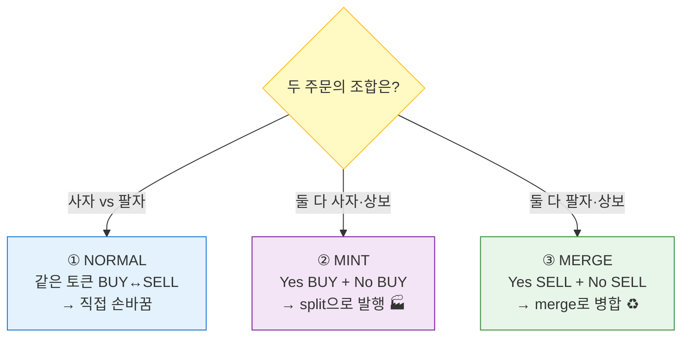
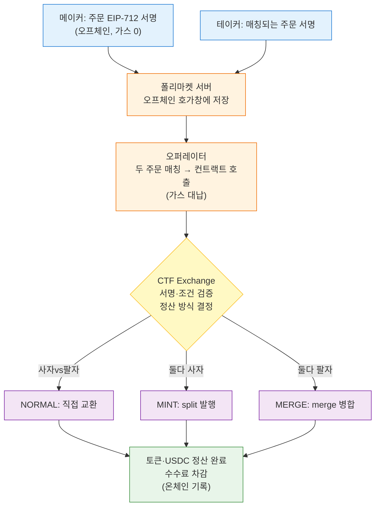

# 📕 Part 3. 폴리마켓 거래 계약 (CTF Exchange / CLOB) 심화

> [Part 2-E·F](02-polymarket-mechanics.md)에서 "오프체인 오더북 + 온체인 정산"을 개념적으로 봤죠.
> 여기서는 그 **실제 거래 계약(CTF Exchange)**이 어떻게 생겼는지 한 단계 더 들어갑니다.

> ⚠️ **정확도 주의:** 이 문서는 **개념 이해용**이에요. 함수명·필드명·세부 로직은 버전에 따라 다를 수 있으니, 실제 구현은 반드시 [공식 레포](#-공식-레포--참고-링크)로 대조하세요. ([Part 1-3 가스](01-blockchain-basics.md) / [Part 2-B CTF](02-polymarket-mechanics.md#2-b-결과의-토큰화-ctf) 선행 학습 권장)

[← Part 2로](02-polymarket-mechanics.md) | [목차](README.md) | [Part 4 로드맵 →](04-build-roadmap.md)

---

## 3-1. CTF Exchange란? — 한 줄 개념

**한 줄 정의:** 폴리마켓의 **거래소 역할을 하는 스마트 컨트랙트**. 오프체인에서 서명된 주문을 받아 **온체인에서 토큰 교환을 정산**해주는 계약.

[Part 2-A의 4층 구조](02-polymarket-mechanics.md#a-2-폴리마켓-전체-그림-4개-레이어)에서 **③ 거래 엔진**이 바로 이거예요.

```
② CTF        = Yes/No 토큰을 "만드는" 공장 (split/merge/redeem)
③ CTF Exchange = 그 토큰을 "사고파는" 거래소  ← 지금 이 문서
```

### 🏪 비유: 무인 정산 창구
CTF Exchange는 **점원 없는 정산 창구**예요.
```
손님들(메이커/테이커)이 "이 가격에 거래할게요" 서명한 주문서를 제출
→ 창구(컨트랙트)가 서명을 확인하고
→ 양쪽의 토큰과 USDC를 맞바꿔줌 (정산)
```
중요한 건, **"주문을 모으고 짝짓는 일"은 창구 밖(오프체인)에서** 하고, 창구는 **"짝지어진 거래의 최종 정산"만** 한다는 거예요.

---

## 3-2. 하이브리드 CLOB 복습 — 왜 이렇게 나눴나

**CLOB = Central Limit Order Book** (중앙 지정가 호가창). 폴리마켓은 **하이브리드(반탈중앙)** 방식이에요.

| 단계 | 어디서 | 누가 | 가스 |
|------|--------|------|------|
| 주문 생성·서명 | 오프체인 | 사용자 (EIP-712 서명) | 0 |
| 주문 저장·호가창 관리 | 오프체인 | 폴리마켓 서버 | 0 |
| 주문 매칭(짝짓기) | 오프체인 | **오퍼레이터(Operator)** | 0 |
| **최종 정산(토큰 교환)** | **온체인** | **CTF Exchange 컨트랙트** | 발생 |

> 💡 **핵심 설계 철학:** "신뢰가 필요 없는 정산(자산 이동)"만 블록체인에 올리고, "효율이 중요한 매칭"은 빠른 서버에서 처리. → [Part 2-F 가스 절약](02-polymarket-mechanics.md#2-f-가스비-절약의-비밀)의 실체.

### 그럼 오퍼레이터를 믿어야 하나? 🤔
오퍼레이터(폴리마켓)는 **매칭은 하지만, 당신 자산을 훔칠 순 없어요.**
```
오퍼레이터가 할 수 있는 것: 어떤 주문끼리 체결할지 짝짓기
오퍼레이터가 할 수 없는 것: 당신이 서명 안 한 거래를 실행
                          서명한 가격보다 불리하게 체결
```
왜냐하면 **모든 거래엔 사용자의 EIP-712 서명이 필요**하고, 컨트랙트가 서명과 조건(가격·수량)을 검증하니까요. **"매칭은 위탁, 정산은 코드가 보장"** 구조예요.

---

## 3-3. 주문(Order)의 구조 — EIP-712 서명 데이터

사용자가 서명하는 "주문서"가 어떻게 생겼는지 봅시다. 대략 이런 필드들로 구성돼요.

| 필드 | 의미 | 비유 |
|------|------|------|
| **salt** | 중복 방지용 난수 | 주문서 일련번호 |
| **maker** | 주문을 낸 자금의 주인 (지갑) | 주문자 |
| **signer** | 실제 서명한 주소 (프록시면 다를 수 있음) | 서명인 |
| **taker** | 거래 상대 지정 (0이면 누구나 OK) | 지정 상대 |
| **tokenId** | 거래할 ERC-1155 결과 토큰 ID | 어떤 티켓(Yes/No) |
| **makerAmount** | 메이커가 내놓는 양 | 내가 주는 것 |
| **takerAmount** | 메이커가 받길 원하는 양 | 내가 받을 것 |
| **expiration** | 주문 만료 시각 | 유효기간 |
| **nonce** | 취소·무효화용 번호 | 주문 묶음 번호 |
| **feeRateBps** | 수수료율 (bps, 1bp=0.01%) | 수수료 |
| **side** | BUY(매수) / SELL(매도) | 사자/팔자 |
| **signatureType** | 서명 방식 (EOA / 프록시 / Safe) | 서명 종류 |
| **signature** | 위 내용에 대한 EIP-712 서명 | 도장 |

### BUY vs SELL이 의미하는 것
```
BUY  주문: USDC를 주고 → 결과 토큰(Yes 또는 No)을 받음
SELL 주문: 결과 토큰을 주고 → USDC를 받음
```
가격은 `makerAmount`와 `takerAmount`의 **비율**로 표현돼요.
```
예) Yes를 0.60에 100개 매수(BUY):
    makerAmount = 60 USDC  (내가 주는 것)
    takerAmount = 100 Yes  (내가 받을 것)
    → 가격 = 60/100 = 0.60
```

> 📌 가격을 따로 안 적고 **수량 비율로 표현**하는 게 포인트예요. 그래서 컨트랙트는 "이 비율 이상으로 유리하게만 체결"을 보장할 수 있어요.

---

## 3-4. 메이커·테이커·오퍼레이터 — 3명의 등장인물

| 역할 | 하는 일 | [Part 2-E](02-polymarket-mechanics.md#2-e-거래-메커니즘) 연결 |
|------|---------|------|
| **메이커(Maker)** | 주문을 미리 서명해 호가창에 올려둠 | 중고장터에 물건 올린 사람 |
| **테이커(Taker)** | 그 주문을 잡아 거래를 성사시킴 | 바로 사가는 사람 |
| **오퍼레이터(Operator)** | 메이커·테이커 주문을 짝지어 컨트랙트에 제출 | 거래를 중개·전송하는 직원 |

### 거래가 성사되는 과정
```
1. 메이커: 주문 서명 → 폴리마켓 서버(오프체인 호가창)에 등록
2. 테이커: "그 주문 잡을게" 주문 서명
3. 오퍼레이터: 두 주문을 매칭 → CTF Exchange의 정산 함수 호출 (가스 대납)
4. 컨트랙트: 양쪽 서명 검증 → 토큰·USDC 교환 → 수수료 차감
```

> ⛽ 3번에서 **오퍼레이터가 트랜잭션을 전송**(가스 대납)하기 때문에, 사용자는 가스(POL)가 없어도 거래할 수 있어요. → [Part 2-F3 가스리스](02-polymarket-mechanics.md#f-3-콤보③--가스리스gasless-서명--릴레이어-대납-)와 동일.

---

## 3-5. 정산의 3가지 방식 ⭐ (가장 중요)

CTF Exchange의 진짜 똑똑한 부분이에요. 짝지어진 두 주문의 조합에 따라 **3가지 방식**으로 정산해요. ([Part 2-B의 split/merge](02-polymarket-mechanics.md#b-2-conditional-tokens-framework--split--merge--redeem)가 여기서 쓰여요!)

### ① NORMAL (직접 교환) — 같은 토큰을 사자 vs 팔자
가장 단순. **A는 Yes를 사고, B는 Yes를 판다** → 그냥 맞바꿈.
```
A(BUY Yes):  USDC 60 ───▶ B
B(SELL Yes): Yes 100 ───▶ A
→ 이미 존재하는 토큰을 손바꿈 (mint/merge 불필요)
```

### ② MINT (발행) — 서로 반대편을 "둘 다 사자"
**A는 Yes를 사고, B는 No를 산다** (둘 다 BUY, 상호보완).
이때 시장에 토큰이 부족하면? → 컨트랙트가 **두 사람의 USDC를 모아 `split`으로 새로 발행**!
```
A(BUY Yes) USDC 60 ┐
                   ├─▶ 합쳐서 split → Yes 100 + No 100 생성
B(BUY No)  USDC 40 ┘     → A에게 Yes 100, B에게 No 100 분배
(60+40 = 100 USDC = 100세트)
```
> 💡 [Part 2-C의 "토큰은 USDC가 들어올 때 즉석 발행"](02-polymarket-mechanics.md#c-2-최초-토큰-생성--splitposition)이 **바로 이 순간** 일어나요. 매수자 둘이 만나면 토큰이 새로 태어남.

#### 🍕 "둘 다 사자"가 어떻게 민팅이 되지? — 피자 비유

"매수자 둘이 만났는데 토큰이 새로 생긴다"가 마법처럼 느껴질 수 있어요. 사실은 **단순 합산**이에요.

> **핵심: Yes 매수자 + No 매수자 = 합치면 "세트 1개를 예치하는 사람" 한 명.**

피자 한 판 = $1 세트라고 해봐요.
```
Alice: "왼쪽 반쪽(Yes)만 $0.60에 살래"
Bob:   "오른쪽 반쪽(No)만 $0.40에 살래"
→ 둘 다 '반쪽'만 원함. 온전한 피자를 원하는 사람은 없음.

가게(거래소):
  ① Alice $0.60 + Bob $0.40 = $1.00 걷음
  ② 그 $1로 피자 한 판을 만듦 (= split = 민팅 🍕)
  ③ 왼쪽 → Alice(Yes), 오른쪽 → Bob(No)
```
**피자는 원래 없었어요.** 두 반쪽 손님의 돈을 합쳐 새로 만든 거죠. **별도 예치자가 1도 필요 없어요 — 두 매수자가 곧 예치자.**

#### 왜 딱 맞아떨어지나? → Yes + No = 1

```
Yes 매수가 + No 매수가 = 0.60 + 0.40 = 1.00 USDC
                                        ↑ 정확히 세트 1개 민팅할 돈!
```
두 매수 가격의 합이 [항상 1](02-polymarket-mechanics.md#b-3-핵심-등식-yes--no--1-)이라, 합치면 정확히 세트 하나 값이 돼요. (우연이 아니라 등식이 보장)

#### 📊 상황별로 보면 (매도자가 있냐 없냐)

| 상황 | 방식 | 토큰 |
|------|------|------|
| Yes **사자** ↔ Yes **팔자** (매도자 있음) | **NORMAL** | 기존 토큰 손바뀜 |
| Yes 사자 + No 사자 (**둘 다 사자**, 매도자 없음) | **MINT** | 새로 발행 🏭 |
| Yes **팔자** + No **팔자** (둘 다 팔자) | **MERGE** | 소각 🔥 |

> 💡 **MINT는 "Yes를 팔 사람이 없을 때"의 해결책**이에요. 매도 물량이 없어도, 반대편(No)을 사려는 사람만 있으면 거래소가 둘을 묶어 새 토큰을 찍어 양쪽을 만족시켜요. → **"매도 물량이 없어서 거래가 막히는" 일이 줄어듦.**

### ③ MERGE (병합) — 서로 반대편을 "둘 다 팔자"
**A는 Yes를 팔고, B는 No를 판다** (둘 다 SELL, 상호보완).
→ 컨트랙트가 Yes+No를 `merge`해서 USDC로 만들어 지급.
```
A(SELL Yes) Yes 100 ┐
                    ├─▶ merge → USDC 100 회수
B(SELL No)  No 100  ┘     → A에게 60, B에게 40 USDC 분배
```

### 한눈에 정리
| 방식 | 주문 조합 | 컨트랙트 동작 | 토큰 |
|------|-----------|---------------|------|
| **NORMAL** | 같은 토큰 BUY ↔ SELL | 직접 교환 | 그대로 |
| **MINT** | Yes BUY + No BUY | `split`으로 발행 | 새로 생성 |
| **MERGE** | Yes SELL + No SELL | `merge`로 병합 | 소각 |



> 🎯 이 3-방식 덕분에 **유동성이 효율적**이에요. 토큰이 없어도 매수자끼리 만나면 즉석에서 만들어내니까([MINT]), 항상 거래가 가능해요.

---

## 3-6. 서명 타입 & 프록시 월렛

`signatureType` 필드는 **"누가 어떻게 서명했나"**를 구분해요. 대략 세 종류:

| 타입 | 설명 |
|------|------|
| **EOA** | 일반 지갑(메타마스크 등)이 직접 서명 |
| **POLY_PROXY** | 폴리마켓 프록시 지갑이 대리 서명 |
| **POLY_GNOSIS_SAFE** | Gnosis Safe 기반 스마트 컨트랙트 지갑 |

### 왜 프록시 월렛? 🪆
프록시 월렛은 **사용자마다 만들어지는 스마트 컨트랙트 지갑**이에요.
```
장점:
- 승인(approve)·거래를 묶어 처리 → 사용자 경험 매끄러움
- 릴레이어가 대신 실행하기 쉬움 → 가스리스 구현
- 소셜 로그인/이메일 지갑 등과 연동 쉬움
```
> [Part 2-F4 프록시 월렛](02-polymarket-mechanics.md#f-4-메타-트랜잭션·프록시-월렛-기술-디테일)에서 짧게 언급한 게 이거예요. CTF Exchange가 이 서명 타입들을 모두 검증할 수 있게 설계돼 있어요.

---

## 3-7. 수수료 (feeRateBps)

주문에 `feeRateBps`(베이시스 포인트, 1bp = 0.01%) 필드가 있어요.

```
수수료는 "받는 자산(proceeds)" 기준으로 부과 (대칭적)
예) feeRateBps = 0 이면 → 무료 (폴리마켓이 오래 유지한 정책)
```

> [Part 2-I 수익 모델](02-polymarket-mechanics.md#i-1-수익-모델--수수료-0-전략--예치금-이자-)에서 봤듯, 컨트랙트엔 수수료 기능이 **있지만** 성장 위해 0으로 둔 기간이 길었어요. 즉, **"기능은 존재, 값은 0"** 상태.

---

## 3-8. 주문 취소 · nonce · 보안

### 주문 취소 (오프체인 vs 온체인)
```
일반 취소: 폴리마켓 서버에서 주문 내림 (오프체인, 가스 0)
강력 취소: 컨트랙트에서 직접 무효화 (온체인) — 서버를 못 믿을 때 대비
```

### nonce로 무더기 취소
```
nonce를 올리면 → 그 이전 nonce로 서명된 주문이 한꺼번에 무효화
→ "내 모든 미체결 주문 취소" 같은 동작 가능
```

### 권한(Role) 구조
| 역할 | 권한 |
|------|------|
| **Admin** | 컨트랙트 설정, 오퍼레이터 등록/해제, 토큰 등록 |
| **Operator** | 주문 매칭·정산 함수 호출 (화이트리스트된 주소만) |

> 🔐 **오퍼레이터는 아무나 못 돼요.** Admin이 등록한 주소만 정산을 트리거할 수 있어요. 단, 그들도 "사용자 서명 없는 거래"는 못 만들어요. → 권한 남용을 코드가 차단.

---

## 3-9. 토큰 등록 (registerToken) — conditionId 연결

거래하려면 컨트랙트가 **"이 tokenId가 어느 시장의 Yes/No이고, 짝(complement)이 무엇인지"**를 알아야 해요.

```
registerToken(tokenId, complementTokenId, conditionId)
→ "Yes 토큰의 짝은 No 토큰"이라고 등록
→ MINT/MERGE 정산 때 짝을 알아야 split/merge 가능
```

> [Part 2-B4 토큰 ID 구조](02-polymarket-mechanics.md#b-4-토큰-id-내부구조-조금-기술적-)의 `conditionId`·`positionId`가 여기서 연결돼요. 등록을 통해 "Yes ↔ No" 짝 관계를 컨트랙트가 인지합니다.

---

## 3-10. 전체 거래 흐름 (종합)



---

## ✅ Part 3 요약 체크리스트

| 개념 | 핵심 한 줄 |
|------|-----------|
| **CTF Exchange** | 폴리마켓의 "거래소 컨트랙트" (정산 담당) |
| **하이브리드 CLOB** | 매칭은 오프체인, 정산만 온체인 |
| **주문(Order)** | EIP-712로 서명된 데이터 (maker/tokenId/amount/side…) |
| **BUY / SELL** | BUY=USDC→토큰, SELL=토큰→USDC, 가격은 수량 비율 |
| **오퍼레이터** | 매칭·전송(가스 대납)하지만 서명 없는 거래는 불가 |
| **정산 3방식** | NORMAL(교환) / MINT(split 발행) / MERGE(병합) |
| **가스리스** | 프록시 월렛 + 서명 타입으로 구현 |
| **수수료** | feeRateBps 기능은 있으나 0으로 운영해온 역사 |
| **Operator** | 화이트리스트, 권한 남용은 코드가 차단 |

---

## 📚 공식 레포 & 참고 링크

> ⚠️ 위 설명의 **정확한 함수명·필드·로직은 반드시 아래 원본으로 검증**하세요. (버전에 따라 다를 수 있음)

| 자료 | 링크 |
|------|------|
| **CTF Exchange 컨트랙트** (핵심) | [github.com/Polymarket/ctf-exchange](https://github.com/Polymarket/ctf-exchange) |
| **Conditional Tokens (CTF)** | [github.com/gnosis/conditional-tokens-contracts](https://github.com/gnosis/conditional-tokens-contracts) |
| **CLOB 클라이언트(주문 생성 SDK)** | [github.com/Polymarket/clob-client](https://github.com/Polymarket/clob-client) |
| **폴리마켓 공식 문서** | [docs.polymarket.com](https://docs.polymarket.com) |
| EIP-712 (서명 표준) | [eips.ethereum.org/EIPS/eip-712](https://eips.ethereum.org/EIPS/eip-712) |

### 🎯 다음 학습 단계
1. [ctf-exchange 레포](https://github.com/Polymarket/ctf-exchange)의 `src/` 에서 **Order 구조체**와 `matchOrders` / `fillOrder` 실제 코드 읽기
2. **MINT/MERGE 분기 로직**이 코드에서 어떻게 구현됐는지 대조
3. [Part 4-7 미니 컨트랙트](04-build-roadmap.md#4-7-미니-예측시장-컨트랙트-solidity)에 **간단한 주문 매칭 기능**을 직접 추가해보기

---

[← Part 2로](02-polymarket-mechanics.md) | [목차로](README.md) | [Part 4 로드맵 →](04-build-roadmap.md)
