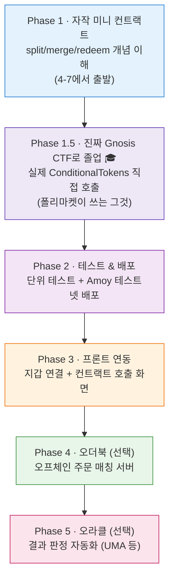
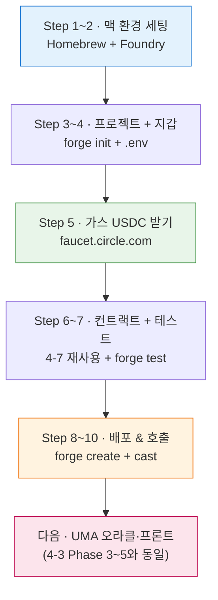
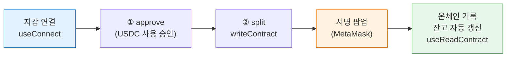

# 🛠️ Part 4. 직접 만들어보기 — 미니 예측시장 학습 로드맵

> "폴리마켓 같은 걸 직접 만들어보려면 뭘, 어떤 순서로 배워야 할까?"에 대한 **단계별 지도**예요.
> 앞 파트들([Part 1~4](README.md))이 *"어떻게 돌아가나(이론)"*였다면, 여기는 *"어떻게 만드나(실전)"*입니다.

[← Part 3 거래 계약](03-ctf-exchange.md) | [목차](README.md) | [부록 →](05-appendix.md)

---

## 4-0. 먼저: 마음가짐 — "작게 시작하라" 🐣

폴리마켓 전체를 처음부터 만들려고 하면 **무조건 좌절**해요. (오더북 서버 + 컨트랙트 + 프론트 + 오라클 + 브릿지…)

> 🎯 **목표를 잘게 쪼개세요.** "예측시장 클론"이 아니라 →
> **"USDC 넣으면 Yes/No 토큰 주고, 결과 정하면 정산해주는 컨트랙트 하나"**부터.

```
❌ 처음부터: 폴리마켓 완전 클론
✅ 1단계 목표: split/merge/redeem 되는 컨트랙트 1개 (4-7에 이미 있음!)
✅ 2단계 목표: 그걸 테스트넷에 올리고 지갑으로 호출
✅ 3단계 목표: 간단한 웹 화면 붙이기
```

[4-7의 미니 컨트랙트](#4-7-미니-예측시장-컨트랙트-solidity)가 바로 그 **1단계 출발점**이에요.

---

## 4-1. 사전 지식 — 뭘 알아야 시작하나

| 필요한 것 | 수준 | 어디서 |
|-----------|------|--------|
| **블록체인 기본 개념** | 필수 | ✅ 이미 [Part 1](01-blockchain-basics.md)에서 배움 |
| **Solidity** (스마트 컨트랙트 언어) | 필수 | 4-5 자료 참고 |
| **JavaScript / TypeScript** | 필수 (프론트·연동) | 기존 지식 활용 |
| **터미널 / Git** | 기본 | — |
| **React** | 프론트 만들 때 | 선택(나중) |

> 💡 **Solidity는 JS와 문법이 비슷**해요 (중괄호, 세미콜론). JS 좀 해봤으면 진입장벽이 낮아요. 다만 **"가스·불변성·보안"** 사고방식이 달라서 그게 진짜 학습 포인트예요.

---

## 4-2. 개발 도구 세팅 🧰

처음엔 **설치 없이 브라우저에서** 시작하고, 익숙해지면 로컬 도구로 넘어가세요.

### 입문용 (설치 0)
| 도구 | 용도 |
|------|------|
| **[Remix IDE](https://remix.ethereum.org)** | 브라우저에서 Solidity 작성·컴파일·배포 (가장 쉬움) |
| **[MetaMask](https://metamask.io)** | 브라우저 지갑 (테스트넷 연결) |

### 본격용 (로컬 설치)
| 도구 | 용도 |
|------|------|
| **Foundry** (추천) 또는 **Hardhat** | 컴파일·테스트·배포 프레임워크 |
| **OpenZeppelin Contracts** | 검증된 표준 컨트랙트 라이브러리 |
| **ethers.js / viem / wagmi** | 프론트 ↔ 컨트랙트 연결 (JS/TS) |
| **Alchemy / Infura** | 블록체인 접속 RPC 노드 |

### 테스트 환경 (공짜 돈으로 연습!)
```
Polygon Amoy 테스트넷 사용 (※ 옛 Mumbai는 2024년 폐기됨)
→ Faucet(수도꼭지)에서 가짜 테스트 토큰 무료로 받아서
→ 진짜 돈 없이 마음껏 배포·실험
```

> ⚠️ **절대 메인넷(진짜 돈)에서 연습하지 마세요.** 테스트넷에서 충분히 검증 후에만.

---

## 4-3. 단계별 로드맵 🗺️



### Phase 1 — 스마트 컨트랙트 만들기 🧱
```
목표: USDC(가짜) 넣으면 Yes/No 발행, 결과 정하면 정산되는 컨트랙트
- [4-7 미니 컨트랙트] 그대로 Remix에 붙여넣고 이해하기
- 가짜 ERC-20(테스트 USDC) 배포해서 split → merge → resolve → redeem 호출
- 직접 변형: 수수료 추가? 다중 결과(3개 이상)?
```
→ [Part 2-B](02-polymarket-mechanics.md#2-b-결과의-토큰화-ctf) · [4-7](#4-7-미니-예측시장-컨트랙트-solidity) 복습

### Phase 1.5 — 진짜 Gnosis CTF로 "졸업" 🎓 ⭐
```
목표: 자작 미니 버전을 떠나, 폴리마켓이 실제로 쓰는
      Gnosis Conditional Tokens(CTF)를 직접 다뤄보기
- gnosis/conditional-tokens-contracts 가져오기 (forge install / npm)
- prepareCondition(oracle, questionId, 2) 로 Yes/No 시장 만들기
- splitPosition 으로 USDC → Yes/No 발행 (← 진짜 CTF!)
- mergePositions / redeemPositions 호출해보기
- 자작(4-7) 버전과 "어디가 같고 어디가 다른지" 비교
```
> 💡 **이게 "개념(자작) → 실전(CTF)"을 잇는 다리**예요. [Part 2-B의 실제 코드](02-polymarket-mechanics.md#2-b-결과의-토큰화-ctf)와 [Part 3 CTF Exchange](03-ctf-exchange.md)에서 본 코드가 비로소 손에 잡혀요. **폴리마켓도 이 CTF를 그대로 재사용**했어요([Polygonscan 확인됨](03-ctf-exchange.md)). 바퀴를 다시 발명하지 않는 거죠.
> 📌 왜 자작부터? → CTF는 다중 결과·부분 분할까지 일반화돼 **처음 보면 복잡**해요. 자작 버전으로 원리를 잡은 뒤 보면 "아, 이게 그거구나" 하고 읽혀요.

→ [Gnosis CTF 문서](https://docs.gnosis.io/conditionaltokens/) · [레포](https://github.com/gnosis/conditional-tokens-contracts) · [Part 3](03-ctf-exchange.md)

### Phase 2 — 테스트 & 테스트넷 배포 🧪
```
목표: 코드가 진짜 의도대로 동작하는지 검증 + 실제 체인에 올려보기
- 단위 테스트 작성 (Foundry: forge test / Hardhat: mocha)
  · "split하면 잔고가 늘어나는가?" "결과 후 redeem되는가?"
- Polygon Amoy 테스트넷에 배포
- Polygonscan(Amoy)에서 내 컨트랙트 확인
```
> 💡 스마트 컨트랙트는 **배포 후 수정 불가**([불변성](01-blockchain-basics.md#1-4-스마트-컨트랙트-))이라, **테스트가 생명**이에요.

### Phase 3 — 프론트엔드 연동 🖥️
```
목표: 버튼 누르면 컨트랙트가 호출되는 웹 화면
- React + wagmi/viem로 지갑 연결(Connect Wallet)
- "베팅하기" 버튼 → 컨트랙트 함수 호출
- 잔고·가격 표시
```
→ [Part 1-7 서명](01-blockchain-basics.md#1-7-지갑·키·서명-)이 여기서 실제로 쓰임 (트랜잭션 서명)

### Phase 4 — 오더북 (선택, 고급) 📖
```
목표: 폴리마켓식 "오프체인 주문 + 온체인 정산"
- Node.js 서버로 주문 저장·매칭
- EIP-712 서명 주문 받기
- 매칭된 주문을 컨트랙트로 정산
```
> [Part 3 CTF Exchange](03-ctf-exchange.md)가 이 단계의 참고서. **난이도 급상승** 구간이에요.

### Phase 5 — 오라클 적용 (선택, 고급) 🔮
"결과를 누가 정하나?"를 **수동 → 탈중앙**으로 단계적으로 올리는 과정이에요. (Phase 1.5가 "자작→진짜 CTF"였듯, 여기선 "수동→진짜 UMA")

```
[Stage A] 수동 오라클 (중앙화) — 출발점
   - resolve(outcome)를 onlyOwner로 → 관리자(나)가 직접 결과 입력
   - 가장 단순. 단, "운영자를 믿어야" 하는 한계
        │  졸업 🎓
        ▼
[Stage B] 진짜 UMA Optimistic Oracle 연동 — 탈중앙화
   - UMA OptimisticOracleV3에 "결과 주장(assertion)" 등록 + 보증금
   - 이의제기 기간 무분쟁 → 자동 확정 / 분쟁 → DVM 투표
   - 콜백으로 컨트랙트가 결과 받아 redeem 활성화
```
> 💡 **팁:** Stage A(수동)만으로도 "동작하는 예측시장"은 완성돼요. UMA 연동(Stage B)은 **신뢰를 코드로 옮기는 고급 단계**. [Part 2-G](02-polymarket-mechanics.md#2-g-결과-판정-오라클--폴리마켓의-심장-)에서 본 제안 → 이의제기 → DVM 흐름이 실제 코드가 돼요.
> 📌 **UMA vs Chainlink:** Chainlink는 "가격 데이터"에 강하고, **UMA는 "임의의 현실 사건(비 왔나? 누가 이겼나?)" 판정**에 강해요 — 그래서 폴리마켓이 UMA를 써요.

→ [Part 2-G UMA](02-polymarket-mechanics.md#2-g-결과-판정-오라클--폴리마켓의-심장-) · [UMA 공식 문서](https://docs.uma.xyz)

---

## 4-4. 난이도별 목표 (어디까지 갈지 정하기) 🎚️

| 레벨 | 목표 | 포함 Phase | 예상 기간* |
|------|------|-----------|-----------|
| **🟢 Level 1 (입문)** | Remix에서 미니 컨트랙트 돌려보기 | Phase 1 | 1~2주 |
| **🟡 Level 2 (중급)** | 진짜 Gnosis CTF 사용 + 테스트넷 배포 + 웹에서 베팅 | Phase 1.5~3 | 1~2개월 |
| **🔴 Level 3 (고급)** | 오더북 + 오라클까지 폴리마켓식 구조 | Phase 1~5 | 수개월+ |

\* 학습 시간에 따라 천차만별 — 어디까지나 감 잡기용

> 👉 **대부분은 Level 2까지만 해도 "탈중앙 앱(dApp)을 만들 줄 안다"고 할 수 있어요.** Level 3은 본격 프로덕트 영역.

---

## 4-5. 추천 학습 자료 📚

### Solidity 입문
| 자료 | 특징 |
|------|------|
| [CryptoZombies](https://cryptozombies.io) | 게임 만들며 배우는 Solidity (입문 최고) |
| [Solidity by Example](https://solidity-by-example.org) | 짧은 예제 모음 (사전처럼) |
| [공식 문서](https://docs.soliditylang.org) | 정확한 레퍼런스 |

### 개발 프레임워크
| 자료 | 특징 |
|------|------|
| [Foundry Book](https://book.getfoundry.sh) | Foundry 공식 가이드 (요즘 대세) |
| [Hardhat 문서](https://hardhat.org) | JS 친화적 프레임워크 |
| [OpenZeppelin](https://docs.openzeppelin.com/contracts) · [Wizard](https://wizard.openzeppelin.com) | 검증된 컨트랙트 + 코드 생성기 |

### 프론트 연동
| 자료 | 특징 |
|------|------|
| [wagmi](https://wagmi.sh) / [viem](https://viem.sh) | React용 web3 라이브러리 (현대적) |
| [ethers.js](https://docs.ethers.org) | 클래식 web3 라이브러리 |

### 폴리마켓 특화
| 자료 | 특징 |
|------|------|
| [Gnosis Conditional Tokens 문서](https://docs.gnosis.io/conditionaltokens/) | CTF 원리 ([Part 2-B](02-polymarket-mechanics.md#2-b-결과의-토큰화-ctf)) |
| [Polymarket ctf-exchange](https://github.com/Polymarket/ctf-exchange) | 실제 거래 계약 ([Part 3](03-ctf-exchange.md)) |
| [docs.polymarket.com](https://docs.polymarket.com) | 공식 개발자 문서 |

---

## 4-6. 흔한 실수 & 주의 ⚠️

| 실수 | 왜 위험 | 대처 |
|------|---------|------|
| **메인넷에서 바로 실험** | 진짜 돈 날림 | 무조건 테스트넷 먼저 |
| **컨트랙트 직접 다 짜기** | 보안 취약점 위험 | 검증된 라이브러리(OZ, Gnosis CTF) 재사용 |
| **테스트 생략** | 배포 후 수정 불가 → 버그 영구화 | 단위 테스트 필수 |
| **개인키 코드에 하드코딩** | 자금 탈취 | 환경변수·지갑 사용, 절대 커밋 X |
| **감사(audit) 없이 메인넷 배포** | 해킹 표적 | 실서비스면 전문 감사 필수 |

> 🔐 폴리마켓도 **검증된 Gnosis CTF를 재사용**했어요([Polygonscan 확인됨](03-ctf-exchange.md)). "바퀴를 다시 발명하지 말 것"이 핵심.

---

## 4-7. 미니 예측시장 컨트랙트 (Solidity)

> ⚠️ **학습용 단순화 예제**입니다. 실제 폴리마켓/CTF는 훨씬 복잡하고, 이 코드는 **개념 이해용**이에요. 실서비스에 쓰면 안 됩니다 (보안 감사·엣지케이스 미처리).

폴리마켓의 핵심 **split / merge / redeem**을 가장 단순하게 흉내 낸 거예요. **Phase 1의 출발점**이에요 — 주석을 따라 읽고 Remix에 붙여넣어 보세요.

```solidity
// SPDX-License-Identifier: MIT
pragma solidity ^0.8.20;

/// @title 미니 예측시장 (학습용)
/// @notice split/merge/redeem 개념만 담은 초단순 버전.
///         담보는 단순화를 위해 이 컨트랙트에 보낸 USDC(ERC-20)라고 가정.
interface IERC20 {
    function transferFrom(address from, address to, uint256 amount) external returns (bool);
    function transfer(address to, uint256 amount) external returns (bool);
}

contract MiniPredictionMarket {
    IERC20 public immutable collateral; // 담보 토큰 (USDC 가정)
    address public immutable oracle;    // 결과를 보고할 주체

    // 결과 상태: 0 = 미정, 1 = YES 승, 2 = NO 승
    uint8 public outcome;
    bool  public resolved;

    // 사용자별 보유 토큰 (Yes/No를 잔고로 표현 — ERC-1155의 단순화)
    mapping(address => uint256) public yesBalance;
    mapping(address => uint256) public noBalance;

    constructor(address _collateral, address _oracle) {
        collateral = IERC20(_collateral);
        oracle = _oracle;
    }

    /// @notice split: USDC를 넣고 Yes + No 세트를 받는다
    /// 1 USDC → Yes 1 + No 1  (여기선 1:1 단위로 단순화)
    function split(uint256 amount) external {
        require(!resolved, "already resolved");
        // 담보를 컨트랙트 금고로 가져옴 (모든 토큰은 USDC로 100% 담보)
        require(collateral.transferFrom(msg.sender, address(this), amount), "transfer fail");
        // 같은 양만큼 Yes와 No를 둘 다 발행
        yesBalance[msg.sender] += amount;
        noBalance[msg.sender]  += amount;
    }

    /// @notice merge: Yes + No 세트를 반납하고 USDC를 돌려받는다
    function merge(uint256 amount) external {
        require(yesBalance[msg.sender] >= amount, "not enough YES");
        require(noBalance[msg.sender]  >= amount, "not enough NO");
        // 세트를 소각
        yesBalance[msg.sender] -= amount;
        noBalance[msg.sender]  -= amount;
        // 담보 환불 (Yes+No = 항상 1 USDC 가치)
        require(collateral.transfer(msg.sender, amount), "refund fail");
    }

    /// @notice 오라클이 결과를 보고 (1=YES, 2=NO)
    function resolve(uint8 _outcome) external {
        require(msg.sender == oracle, "only oracle"); // 결과는 오라클만
        require(!resolved, "already resolved");
        require(_outcome == 1 || _outcome == 2, "bad outcome");
        outcome = _outcome;
        resolved = true;
    }

    /// @notice redeem: 결과 확정 후 이긴 토큰을 1 USDC로 정산
    function redeem() external {
        require(resolved, "not resolved yet");
        uint256 payout;
        if (outcome == 1) {
            // YES 승 → 보유한 Yes만큼 정산, No는 휴지조각
            payout = yesBalance[msg.sender];
        } else {
            // NO 승
            payout = noBalance[msg.sender];
        }
        // 정산 후 잔고 초기화
        yesBalance[msg.sender] = 0;
        noBalance[msg.sender]  = 0;
        require(payout > 0, "nothing to redeem");
        require(collateral.transfer(msg.sender, payout), "payout fail");
    }
}
```

### 이 예제로 배우는 핵심
| 폴리마켓 개념 | 이 코드에서 |
|---------------|-------------|
| **모든 토큰은 USDC로 담보** | `split`에서 `transferFrom`으로 담보를 먼저 받음 |
| **Yes+No=$1** | `merge`가 세트를 항상 `amount` USDC로 환불 |
| **결과는 오라클이 판정** | `resolve`는 `oracle`만 호출 가능 |
| **이긴 토큰만 $1** | `redeem`이 outcome에 따라 한쪽만 지급 |

### 실제 폴리마켓과 다른 점 (단순화한 것)
- 실제는 **ERC-1155**로 토큰을 표현 (여기선 mapping 잔고)
- 실제는 **오더북(오프체인)**에서 사고팖 (여기엔 거래 기능 없음)
- 실제 오라클은 **UMA Optimistic Oracle**(제안/이의제기/투표) (여기선 단순 호출) → Phase 5에서 졸업
- 실제는 **가스리스·릴레이어·프록시 월렛** 등 인프라 존재
- 다중 결과, 수수료, 부분 정산 등 미구현

> 💡 이 코드를 [Remix IDE](https://remix.ethereum.org)에 붙여넣고, 가짜 ERC-20을 배포해 split→merge→resolve→redeem을 직접 호출해보세요. (Phase 1)

---

## 4-8. 🆕 Arc에 올리기 — Mac 0부터 시작하는 실전 로드맵

> 앞 4-1~4-7이 "Polygon 기준"이었다면, 여기는 **Circle Arc**([6-12](06-functions-and-standards.md) 참고)에 똑같은 미니 예측시장을 **맥에서 완전 맨바닥부터** 올리는 따라하기예요.
> Arc는 **EVM 호환**이라 [4-7 컨트랙트](#4-7-미니-예측시장-컨트랙트-solidity)를 **거의 그대로** 쓸 수 있어요. 명령어를 그대로 복사해 붙여넣으면 됩니다.

### ⓘ Arc 테스트넷 접속 정보 (2026년 초 기준 — 시작 전 [docs.arc.network](https://docs.arc.network)에서 재확인)

| 항목 | 값 |
|------|-----|
| **네트워크 이름** | Arc Testnet |
| **RPC URL** | `https://rpc.testnet.arc.network` |
| **Chain ID** | `5042002` |
| **가스(네이티브) 토큰** | **USDC** (소수점 **6자리** ⭐) |
| **테스트 USDC Faucet** | [faucet.circle.com](https://faucet.circle.com) (Arc 선택, 2시간마다 20 USDC) |
| **블록 탐색기** | [testnet.arcscan.app](https://testnet.arcscan.app) |

> 🔑 **Arc만의 결정적 차이 2가지** — 나머지는 Polygon과 똑같아요.
> 1. **가스를 USDC로 낸다.** (Polygon은 POL이 필요했지만, Arc는 faucet USDC 하나로 가스+담보 다 해결)
> 2. **USDC가 네이티브 코인**이라 소수점이 **6자리**. → `1 USDC = 1000000` (ETH의 18자리와 다름, 자주 실수하는 부분)

---

### Step 0. 준비물 체크 (맥)

| 필요한 것 | 확인 방법 |
|-----------|-----------|
| macOS + 터미널 | `Cmd+Space` → "터미널" 검색 |
| 인터넷 | — |
| 지갑(나중에 만듦) | 이 가이드에서 생성 |

> 💡 아무것도 설치 안 돼 있어도 괜찮아요. Step 1부터 다 깔아요.

### Step 1. Homebrew 설치 (맥 패키지 관리자)

터미널을 열고 붙여넣으세요. (이미 있으면 건너뛰기 → `brew --version`으로 확인)

```bash
/bin/bash -c "$(curl -fsSL https://raw.githubusercontent.com/Homebrew/install/HEAD/install.sh)"
```

> 설치 후 안내에 나오는 `eval "$(/opt/homebrew/bin/brew shellenv)"` 줄을 그대로 실행해 PATH를 잡아주세요.

### Step 2. Foundry 설치 (스마트 컨트랙트 개발 도구)

```bash
curl -L https://foundry.paradigm.xyz | bash
```
터미널을 **새 창으로 다시 열고**:
```bash
foundryup
```
확인:
```bash
forge --version    # 버전이 나오면 성공 🎉
```

> Foundry는 컴파일(`forge`)·배포·체인 호출(`cast`)을 다 해주는 도구 모음이에요.

### Step 3. 프로젝트 만들기

```bash
mkdir ~/arc-prediction-market && cd ~/arc-prediction-market
forge init --no-git .
```
`src/`, `test/`, `lib/` 폴더가 생기면 성공. OpenZeppelin도 설치:
```bash
forge install OpenZeppelin/openzeppelin-contracts
```

### Step 4. 테스트 지갑 만들기 🔐

**실제 자산이 든 지갑을 쓰지 마세요.** 연습 전용 새 지갑을 만듭니다:
```bash
cast wallet new
```
출력된 **Address**와 **Private key**를 메모. 이제 `.env` 파일에 저장:
```bash
cat > .env << 'EOF'
ARC_RPC_URL=https://rpc.testnet.arc.network
PRIVATE_KEY=0x여기에_방금_나온_프라이빗키
EOF
```
**개인키 유출 방지** — `.gitignore`에 `.env` 추가 (Git 쓸 경우 필수):
```bash
echo ".env" >> .gitignore
```

> 🚨 개인키는 **절대 커밋·공유 금지**. 이건 테스트넷용이지만 습관을 들이세요. ([4-6 흔한 실수](#4-6-흔한-실수--주의-) 참고)

### Step 5. 가스용 테스트 USDC 받기 ⛽

1. [faucet.circle.com](https://faucet.circle.com) 접속
2. **Arc Testnet** 선택
3. Step 4의 **내 주소** 붙여넣기 → 20 USDC 수령
4. (선택) MetaMask에 Arc 네트워크 수동 추가 — 위 표의 RPC/Chain ID 입력하면 잔액이 보여요

> Arc는 **이 USDC로 가스를 내요.** Polygon에서 POL faucet 따로 받던 단계가 사라진 거예요.

### Step 6. 컨트랙트 넣기 (4-7 재사용 + 가짜 USDC)

Arc에서 USDC는 **네이티브 코인**(가스용)이라, 담보용으로는 **연습용 ERC-20 USDC**를 따로 배포해 [4-7 컨트랙트](#4-7-미니-예측시장-컨트랙트-solidity)를 그대로 씁니다.

**`src/MockUSDC.sol`** (담보용 가짜 토큰, 6자리):
```solidity
// SPDX-License-Identifier: MIT
pragma solidity ^0.8.20;
import "openzeppelin-contracts/contracts/token/ERC20/ERC20.sol";

contract MockUSDC is ERC20 {
    constructor() ERC20("Mock USDC", "mUSDC") {
        _mint(msg.sender, 1_000_000 * 10**6); // 100만 개 (6자리)
    }
    function decimals() public pure override returns (uint8) { return 6; }
}
```

**`src/MiniPredictionMarket.sol`** — [4-7의 코드](#4-7-미니-예측시장-컨트랙트-solidity)를 그대로 붙여넣기. (한 글자도 안 바꿔도 됨)

빌드:
```bash
forge build    # Compiler run successful! 나오면 성공
```

### Step 7. 테스트 작성 & 실행 🧪

**`test/Market.t.sol`** (split 후 잔고가 느는지 검증):
```solidity
// SPDX-License-Identifier: MIT
pragma solidity ^0.8.20;
import "forge-std/Test.sol";
import "../src/MockUSDC.sol";
import "../src/MiniPredictionMarket.sol";

contract MarketTest is Test {
    MockUSDC usdc;
    MiniPredictionMarket market;

    function setUp() public {
        usdc = new MockUSDC();
        market = new MiniPredictionMarket(address(usdc), address(this));
    }

    function test_SplitMintsYesNo() public {
        usdc.approve(address(market), 10 * 10**6);
        market.split(10 * 10**6);
        assertEq(market.yesBalance(address(this)), 10 * 10**6);
        assertEq(market.noBalance(address(this)), 10 * 10**6);
    }
}
```
실행:
```bash
forge test -vv    # [PASS] 나오면 성공 ✅
```

### Step 8. Arc 테스트넷에 배포 🚀

```bash
source .env

# ① 담보용 가짜 USDC 배포
forge create src/MockUSDC.sol:MockUSDC \
  --rpc-url $ARC_RPC_URL --private-key $PRIVATE_KEY --broadcast
# → 출력된 "Deployed to: 0x..." 주소를 메모 (= USDC_ADDR)

# ② 예측시장 배포 (담보=USDC_ADDR, 오라클=내 주소)
forge create src/MiniPredictionMarket.sol:MiniPredictionMarket \
  --rpc-url $ARC_RPC_URL --private-key $PRIVATE_KEY --broadcast \
  --constructor-args <USDC_ADDR> <내_지갑주소>
# → "Deployed to: 0x..." = MARKET_ADDR 메모
```

> 가스가 USDC로 빠져나가요. faucet에서 받은 20 USDC면 충분합니다.

### Step 9. 배포 확인 🔎

[testnet.arcscan.app](https://testnet.arcscan.app)에서 `MARKET_ADDR` 검색 → 내 컨트랙트가 보이면 성공! 🎉

### Step 10. 직접 호출해보기 (cast)

```bash
# 시장에 담보 쓸 수 있게 승인 (10 USDC = 10000000)
cast send <USDC_ADDR> "approve(address,uint256)" <MARKET_ADDR> 10000000 \
  --rpc-url $ARC_RPC_URL --private-key $PRIVATE_KEY

# split: 10 USDC 넣고 Yes/No 받기
cast send <MARKET_ADDR> "split(uint256)" 10000000 \
  --rpc-url $ARC_RPC_URL --private-key $PRIVATE_KEY

# 내 Yes 잔고 확인 (10000000 = 10 나오면 성공)
cast call <MARKET_ADDR> "yesBalance(address)(uint256)" <내_지갑주소> \
  --rpc-url $ARC_RPC_URL
```

축하해요 — **Arc 위에서 돌아가는 나만의 예측시장**이 완성됐어요! 🎊

---

### Arc 로드맵 Phase 지도



> 📌 **여기서부터는 Polygon 로드맵과 100% 동일해요.** 프론트엔드([Phase 3](#phase-3--프론트엔드-연동-)), 진짜 Gnosis CTF([Phase 1.5](#phase-15--진짜-gnosis-ctf로-졸업--)), UMA 오라클([Phase 5](#phase-5--오라클-적용-선택-고급-))을 그대로 이어가면 됩니다. RPC만 Arc로 바꾸면 끝.

### Arc vs Polygon — 명령어가 달라지는 곳은 딱 여기

| 단계 | Polygon | Arc |
|------|---------|-----|
| 가스 토큰 | POL (faucet 따로) | **USDC (faucet 하나로 끝)** |
| RPC URL | Amoy RPC | `https://rpc.testnet.arc.network` |
| Chain ID | 80002 | `5042002` |
| 탐색기 | Amoy Polygonscan | `testnet.arcscan.app` |
| 컨트랙트 코드 | 4-7 | **동일 (그대로)** |
| 도구 | Foundry/Hardhat | **동일** |

---

## 4-9. 🖥️ 프론트엔드 실전 코드 (Phase 3 상세) — wagmi + viem

> [4-3 Phase 3](#phase-3--프론트엔드-연동-)을 **실제 코드**로 푼 거예요. "지갑 연결 → split 버튼 → 잔고 표시"의 최소 동작 예제입니다.
> ⚠️ **학습용 골격**이에요. 에러 처리·로딩 상태·반응형은 간략화했으니 실서비스엔 보강하세요.

### 준비: 라이브러리 설치 (맥, 프로젝트 폴더에서)

```bash
npm create vite@latest my-market-ui -- --template react-ts
cd my-market-ui
npm install
npm install wagmi viem @tanstack/react-query
```

### Step 1. wagmi 설정 — Arc(또는 Polygon) 체인 등록

**`src/wagmi.ts`** — Arc는 EVM이라 `defineChain`으로 커스텀 체인을 만들면 돼요.

```ts
import { http, createConfig } from 'wagmi';
import { defineChain } from 'viem';
import { injected } from 'wagmi/connectors';

// Arc 테스트넷 정의 (값은 docs.arc.network에서 재확인)
export const arcTestnet = defineChain({
  id: 5042002,
  name: 'Arc Testnet',
  nativeCurrency: { name: 'USDC', symbol: 'USDC', decimals: 6 }, // ⭐ 6자리
  rpcUrls: { default: { http: ['https://rpc.testnet.arc.network'] } },
  blockExplorers: { default: { name: 'Arcscan', url: 'https://testnet.arcscan.app' } },
});

export const config = createConfig({
  chains: [arcTestnet],
  connectors: [injected()], // MetaMask 등
  transports: { [arcTestnet.id]: http() },
});
```

### Step 2. 앱 진입점 — Provider 감싸기

**`src/main.tsx`**

```tsx
import { WagmiProvider } from 'wagmi';
import { QueryClient, QueryClientProvider } from '@tanstack/react-query';
import { config } from './wagmi';
import { App } from './App';

const queryClient = new QueryClient();

createRoot(document.getElementById('root')!).render(
  <WagmiProvider config={config}>
    <QueryClientProvider client={queryClient}>
      <App />
    </QueryClientProvider>
  </WagmiProvider>,
);
```

### Step 3. 컨트랙트 ABI (필요한 함수만)

**`src/abi.ts`** — [4-7 미니 컨트랙트](#4-7-미니-예측시장-컨트랙트-solidity)의 함수 시그니처만 추려요.

```ts
export const marketAbi = [
  { type: 'function', name: 'split', stateMutability: 'nonpayable',
    inputs: [{ name: 'amount', type: 'uint256' }], outputs: [] },
  { type: 'function', name: 'yesBalance', stateMutability: 'view',
    inputs: [{ name: '', type: 'address' }], outputs: [{ type: 'uint256' }] },
] as const;

export const erc20Abi = [
  { type: 'function', name: 'approve', stateMutability: 'nonpayable',
    inputs: [{ name: 'spender', type: 'address' }, { name: 'amount', type: 'uint256' }],
    outputs: [{ type: 'bool' }] },
] as const;
```

### Step 4. 메인 화면 — 연결 + 승인 + split + 잔고

**`src/App.tsx`** — [Part 1-7 서명](01-blockchain-basics.md#1-7-지갑·키·서명-)이 `writeContract` 호출 시 실제로 일어나요.

```tsx
import { useAccount, useConnect, useDisconnect, useReadContract, useWriteContract } from 'wagmi';
import { parseUnits } from 'viem';
import { marketAbi, erc20Abi } from './abi';

const MARKET = '0x여기에_배포한_시장주소';
const USDC = '0x여기에_배포한_MockUSDC주소';
const USDC_DECIMALS = 6; // ⭐ Arc/USDC는 6자리

export function App() {
  const { address, isConnected } = useAccount();
  const { connect, connectors } = useConnect();
  const { disconnect } = useDisconnect();
  const { writeContract, isPending } = useWriteContract();

  // 내 Yes 잔고 읽기 (지갑 연결 시에만)
  const { data: yes } = useReadContract({
    address: MARKET, abi: marketAbi, functionName: 'yesBalance',
    args: address ? [address] : undefined,
    query: { enabled: Boolean(address) },
  });

  if (!isConnected) {
    return (
      <main>
        <h1>미니 예측시장</h1>
        <button onClick={() => connect({ connector: connectors[0] })}>
          지갑 연결
        </button>
      </main>
    );
  }

  const amount = parseUnits('10', USDC_DECIMALS); // 10 USDC

  return (
    <main>
      <h1>미니 예측시장</h1>
      <p>연결됨: {address}</p>
      <p>내 Yes 잔고: {yes ? Number(yes) / 10 ** USDC_DECIMALS : 0}</p>

      {/* 1) 시장이 USDC를 쓰도록 승인 */}
      <button disabled={isPending}
        onClick={() => writeContract({
          address: USDC, abi: erc20Abi, functionName: 'approve',
          args: [MARKET, amount],
        })}>
        ① 10 USDC 승인
      </button>

      {/* 2) split: USDC 넣고 Yes/No 받기 */}
      <button disabled={isPending}
        onClick={() => writeContract({
          address: MARKET, abi: marketAbi, functionName: 'split',
          args: [amount],
        })}>
        ② split (베팅 티켓 발행)
      </button>

      <button onClick={() => disconnect()}>연결 해제</button>
    </main>
  );
}
```

### 흐름 정리



> 💡 **핵심:** `writeContract`를 누르면 MetaMask가 떠서 **사용자가 서명**해요. 이게 [Part 1-7](01-blockchain-basics.md#1-7-지갑·키·서명-)의 "서명 = 동의 도장". `useReadContract`는 가스 없이 잔고를 읽고, 트랜잭션 후 자동으로 다시 읽어 화면을 갱신해요.
> 📌 폴리마켓처럼 **오더북 주문**을 넣으려면 이 직접 호출 대신 **CLOB API + 서명**을 써요 → [Part 6-13](06-functions-and-standards.md#6-13-clob로-주문-넣기--실전-코드-py-clob-client--ts)에서 실전 코드로 이어집니다.

---

## ✅ Part 4 체크리스트 (나의 진행도)

> 진행하면서 `☐` → `☑`로 바꿔 체크하세요.

| Phase | 목표 | 진행 |
|-------|------|:----:|
| **Phase 1** | Remix에서 [미니 컨트랙트](#4-7-미니-예측시장-컨트랙트-solidity) split→merge→redeem 호출 | ☐ |
| **Phase 1+** | 수수료 / 다중 결과로 변형 | ☐ |
| **Phase 1.5** 🎓 | 진짜 Gnosis CTF `prepareCondition` → `splitPosition` 직접 호출 | ☐ |
| **Phase 2** | 단위 테스트 + Amoy 테스트넷 배포 | ☐ |
| **Phase 3** | wagmi 지갑 연결 + 베팅 버튼 동작 | ☐ |
| **Phase 4** (선택) | 오프체인 오더북 맛보기 | ☐ |
| **Phase 5** (선택) 🔮 | 수동 resolve → 진짜 UMA Optimistic Oracle 연동 | ☐ |
| **Arc 트랙** 🆕 | [4-8](#4-8--arc에-올리기--mac-0부터-시작하는-실전-로드맵) 따라 맥에서 Arc 테스트넷에 배포 → `split` 호출 성공 | ☐ |

---

## 🎯 지금 당장 할 첫 걸음

> 1. [Remix IDE](https://remix.ethereum.org) 열기
> 2. [4-7 미니 컨트랙트](#4-7-미니-예측시장-컨트랙트-solidity) 붙여넣기
> 3. 컴파일 → 가짜 ERC-20과 함께 배포 → `split` 호출해보기
> 4. 잔고가 Yes/No로 늘어나는 걸 눈으로 확인 🎉

**이 한 번의 성공**이 가장 큰 동기부여가 돼요. 거기서부터 한 Phase씩!

---

[← Part 3 거래 계약](03-ctf-exchange.md) | [목차로](README.md) | [부록 →](05-appendix.md)
