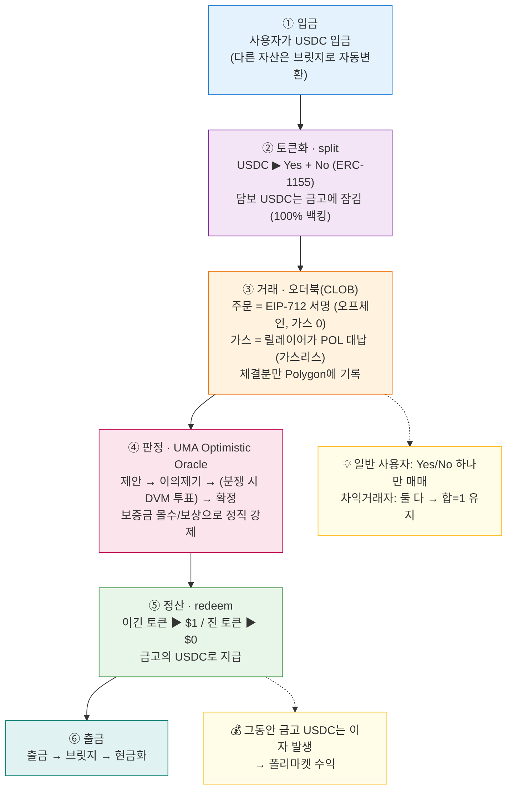

# 📙 Part 5. 부록

> 빠르게 찾아보는 용어 사전, 전체 흐름 요약, EIP/ERC 표준 정리. (미니 컨트랙트 코드는 [Part 4-7](04-build-roadmap.md#4-7-미니-예측시장-컨트랙트-solidity)로 이동)

[← Part 4 로드맵](04-build-roadmap.md) | [목차](README.md)

---

## 5-1. 용어 사전

찾기 쉽게 묶음으로 정리했어요.

### 🔤 블록체인 기초
| 용어 | 한 줄 설명 |
|------|-----------|
| **블록체인** | 모두가 나눠 가진, 못 고치는 공동 장부 |
| **트랜잭션(Tx)** | 블록체인에 기록되는 거래 1건 |
| **블록** | 트랜잭션을 모은 묶음 |
| **합의(Consensus)** | 참여자들이 "이 기록 맞다"고 동의하는 절차 |
| **가스(Gas)** | 블록체인에 기록·실행하는 수수료(기름값) |
| **네이티브 토큰** | 가스비를 내는 그 체인의 기본 코인 (ETH, POL) |
| **스마트 컨트랙트** | 자동 실행되는 자판기 같은 프로그램 |
| **메인넷** | 이더리움 본체 (안전하지만 비쌈) |
| **L2 / 사이드체인** | 메인넷보다 싸고 빠른 보조 네트워크 (Polygon) |
| **지갑(Wallet)** | 내 자산 계정 |
| **개인키** | 절대 노출 금지인 비밀 도장 |
| **서명(Signature)** | "이 거래에 동의함" 도장 찍기 (가스 0) |

### 🔤 토큰·표준
| 용어 | 한 줄 설명 |
|------|-----------|
| **ERC-20** | 똑같은 토큰 표준 (USDC 등 지폐형) |
| **ERC-721** | 유일무이한 NFT 표준 |
| **ERC-1155** | 여러 종류를 한 컨트랙트에서 관리 (폴리마켓 Yes/No) |
| **스테이블코인** | 항상 $1인 디지털 현금 (USDC) |
| **USDC** | 실제 달러로 담보된 스테이블코인 |
| **민팅(Mint)** | 토큰을 **새로 발행(생성)**하는 것. (조폐국처럼 찍어냄) 폴리마켓 split 시 Yes/No 발행 |
| **버닝(Burn)** | 토큰을 **없앰(소각)**하는 것. 민팅의 반대. merge/정산 시 토큰 소각 |

### 🔤 폴리마켓 핵심
| 용어 | 한 줄 설명 |
|------|-----------|
| **예측시장** | 미래 사건의 확률에 베팅하는 시장 |
| **CTF** | Conditional Tokens Framework. Yes/No 토큰 제조 공장 |
| **split** | USDC → Yes + No 세트 만들기 |
| **merge** | Yes + No → USDC 환불 |
| **redeem** | 결과 확정 후 이긴 토큰을 $1로 정산 |
| **conditionId** | 시장(질문)의 고유 ID |
| **positionId** | 실제 Yes/No 토큰의 ID |
| **마켓 메이커** | 초기 유동성(물량)을 공급하는 주체 |
| **Yes/No 토큰** | 결과에 베팅하는 티켓. 이기면 $1, 지면 $0 |

### 🔤 거래
| 용어 | 한 줄 설명 |
|------|-----------|
| **오더북(CLOB)** | 사자/팔자 주문이 쌓인 호가창 |
| **메이커(Maker)** | 주문을 걸어두고 기다리는 사람 (유동성 공급) |
| **테이커(Taker)** | 걸린 주문을 즉시 잡는 사람 (유동성 소모) |
| **매칭 엔진** | 주문을 짝지어 체결하는 핵심 두뇌 (메모리에서 즉시 처리, C++/Rust) |
| **가격 개선(Price Improvement)** | 부른 상한가보다 유리한 기존 매물 가격에 체결되는 것 |
| **현재가** | 정해진 값이 아니라 "가장 최근 체결가" |
| **스프레드(Spread)** | 매도 최저와 매수 최고 사이의 빈 가격 간격 |
| **지정가 주문** | 내가 가격(상한선)을 정하는 주문 |
| **시장가 주문** | 현재가에 즉시 사는 주문 |
| **유동성(Liquidity)** | 시장에 깔린 주문 물량의 두께 |
| **슬리피지(Slippage)** | 큰 주문이 가격을 밀어 불리하게 체결되는 현상 |
| **차익거래(Arbitrage)** | 가격 오류로 무위험 수익을 줍는 기술 |
| **숏(Short)** | 하락에 베팅 (폴리마켓에선 No 매수) |
| **NegRisk** | "여럿 중 하나만 참"인 다중결과 시장 + 자본효율 변환(convert) |

### 🔤 가스 절약·인프라
| 용어 | 한 줄 설명 |
|------|-----------|
| **오프체인** | 블록체인 밖에서 처리 (가스 0) |
| **온체인** | 블록체인에 기록 (가스 발생) |
| **가스리스(Gasless)** | 사용자가 가스를 안 내는 거래 |
| **메타 트랜잭션** | 서명만 하고 전송은 남이 대신 |
| **릴레이어(Relayer)** | 사용자 대신 트랜잭션을 전송·가스 대납하는 주체 |
| **EIP-712** | 사람이 읽을 수 있는 서명 표준 |
| **ERC-2771 / EIP-4337** | 메타 트랜잭션 / 계정 추상화 표준 |
| **프록시 월렛** | 거래를 묶어 처리하는 스마트 컨트랙트 지갑 |
| **브릿지(Bridge)** | 다른 체인으로 자산을 옮기는 다리 |

### 🔤 오라클
| 용어 | 한 줄 설명 |
|------|-----------|
| **오라클(Oracle)** | 바깥세상 정보를 체인에 전해주는 다리 |
| **UMA** | 폴리마켓이 쓰는 탈중앙 오라클 프로젝트 |
| **Optimistic Oracle** | "일단 믿고, 분쟁 시에만 검증"하는 낙관적 오라클 |
| **제안(Propose)** | 결과를 제출하는 행위 (+보증금) |
| **이의제기(Dispute)** | 제안에 반박하는 행위 (+보증금) |
| **DVM** | 분쟁 시 토큰 홀더가 투표로 판정하는 메커니즘 |

### 🔤 USDC 멀티체인·Circle Arc ([Part 6-11·6-12](06-functions-and-standards.md))
| 용어 | 한 줄 설명 |
|------|-----------|
| **네이티브 USDC** | 발행사 Circle이 그 체인에 **직접 찍은** 진짜 USDC (`USDC`) |
| **브릿지 USDC** | 다른 체인 USDC를 다리로 옮긴 복제본 (`USDC.e`) |
| **CCTP** | Circle 공식 체인간 전송 — 원본 소각 → 목적지 네이티브 발행 |
| **Circle Arc** | Circle이 만든 L1. **USDC가 네이티브 가스 토큰**, EVM 호환 |
| **FX 엔진** | Arc 내장 — 스테이블코인 간 환전(USDC↔EURC 등)을 프로토콜 레벨에서 |
| **Malachite** | Arc의 합의 엔진 (1초 미만 즉시 완결성) |

> 📒 **빠른 치트시트:** 컨트랙트별 기능(함수) 전체 목록·언어·표준은 [Part 6](06-functions-and-standards.md)에 표로 정리돼 있어요.

---

## 5-2. 전체 흐름 요약 다이어그램

### 자금·토큰의 일생



> 💡 Mermaid 렌더링 안내는 [README](README.md)에 정리돼 있어요.

### 핵심 등식 정리
```
Yes + No = $1                          (2개 결과)
A + B + C + ... = $1                    (N개 결과)
가격 = 시장이 보는 확률
체인에 기록 적게 + 싼 체인 + 가스 대납 = 가스 절약
```

### 한 줄 최종 요약
> **폴리마켓 = Polygon 위에서 USDC로, 미래 사건의 확률(Yes/No 토큰)을 사고파는 탈중앙 예측시장.**
> 토큰은 USDC 담보로 즉석 발행되고, 거래는 오프체인+가스리스로 싸게, 결과는 UMA 오라클이 검증한다.

---

## 5-3. 이 문서에 나온 EIP/ERC 표준 정리

> **EIP vs ERC?** **EIP**(Ethereum Improvement Proposal)는 모든 개선 제안의 통칭, 그중 **토큰·계약 표준**이 **ERC**예요. 즉 "ERC-20 = EIP-20" (같은 문서). 자세히는 [Part 1-6](01-blockchain-basics.md#1-6-토큰-표준-erc-20--721--1155-).

### 한눈에 보기

| 표준 | 정식 명칭 | 폴리마켓에서의 역할 | 관련 절 |
|------|-----------|---------------------|---------|
| **ERC-20** | Fungible Token | 담보·정산 화폐 **USDC** | 1-6 · 2-B |
| **ERC-721** | Non-Fungible Token | (비교용) 유일무이 NFT — 폴리마켓엔 직접 안 씀 | 1-6 |
| **ERC-1155** | Multi-Token | **Yes/No 결과 토큰** (한 컨트랙트로 다종 관리) | 1-6 · 2-B |
| **EIP-712** | Typed Structured Data Signing | **오프체인 주문 서명** (사람이 읽는 서명) | 1-7 · 3-3 |
| **EIP-1271** | Contract Signature Validation | **프록시·Gnosis Safe 지갑의 서명 검증** (컨트랙트 지갑이 서명자) | 3-6 · 6-3 |
| **EIP-2612** | ERC-20 Permit | **서명만으로 토큰 승인** (USDC 가스리스 approve) | 6-6 |
| **ERC-2771** | Meta-Transactions (Trusted Forwarder) | **가스 대납** — 릴레이어가 대신 전송 | 2-F · 3-6 |
| **EIP-4337** | Account Abstraction | **가스리스·프록시 월렛** 최신 표준 | 2-F · 3-6 |

### 역할별 묶음

```
🪙 토큰 표준        ERC-20(USDC) · ERC-1155(Yes/No) · ERC-721(비교용)
✍️ 서명·가스리스    EIP-712(서명) · EIP-1271(컨트랙트지갑 서명검증)
                   ERC-2771(메타TX) · EIP-2612(permit) · EIP-4337(계정 추상화)
```

> 📌 **참고:** 폴리마켓의 핵심인 **CTF(Conditional Tokens Framework)**는 EIP가 아니라, **ERC-1155 위에 Gnosis가 만든 "프레임워크"**예요. (표준이 아니라 구현체) → [Part 2-B](02-polymarket-mechanics.md#2-b-결과의-토큰화-ctf) · [Part 3](03-ctf-exchange.md)

### 공식 원문 링크

| 표준 | 원문 |
|------|------|
| ERC-20 | [eips.ethereum.org/EIPS/eip-20](https://eips.ethereum.org/EIPS/eip-20) |
| ERC-721 | [eips.ethereum.org/EIPS/eip-721](https://eips.ethereum.org/EIPS/eip-721) |
| ERC-1155 | [eips.ethereum.org/EIPS/eip-1155](https://eips.ethereum.org/EIPS/eip-1155) |
| EIP-712 | [eips.ethereum.org/EIPS/eip-712](https://eips.ethereum.org/EIPS/eip-712) |
| EIP-1271 | [eips.ethereum.org/EIPS/eip-1271](https://eips.ethereum.org/EIPS/eip-1271) |
| EIP-2612 | [eips.ethereum.org/EIPS/eip-2612](https://eips.ethereum.org/EIPS/eip-2612) |
| ERC-2771 | [eips.ethereum.org/EIPS/eip-2771](https://eips.ethereum.org/EIPS/eip-2771) |
| EIP-4337 | [eips.ethereum.org/EIPS/eip-4337](https://eips.ethereum.org/EIPS/eip-4337) |

---

## 🎯 더 공부할 거리

| 주제 | 키워드 |
|------|--------|
| CTF 원본 표준 뜯어보기 | `Gnosis Conditional Tokens` |
| 폴리마켓 거래 계약 | **▶ [Part 3. 거래 계약 심화](03-ctf-exchange.md)** 로 정리됨 · `Polymarket CTF Exchange`, `CLOB` |
| 가스리스 최신 표준 | `EIP-4337 Account Abstraction` |
| 오라클 심화 | `UMA Optimistic Oracle V3`, `DVM` |
| 직접 실습 | **▶ [Part 4. 직접 만들기 로드맵](04-build-roadmap.md)** · `Remix IDE`, `Amoy 테스트넷` |
| 비슷한 프로젝트 비교 | `Augur`, `Gnosis(Omen)`, `Azuro` |

---

[← Part 4 로드맵](04-build-roadmap.md) | [목차로](README.md)
