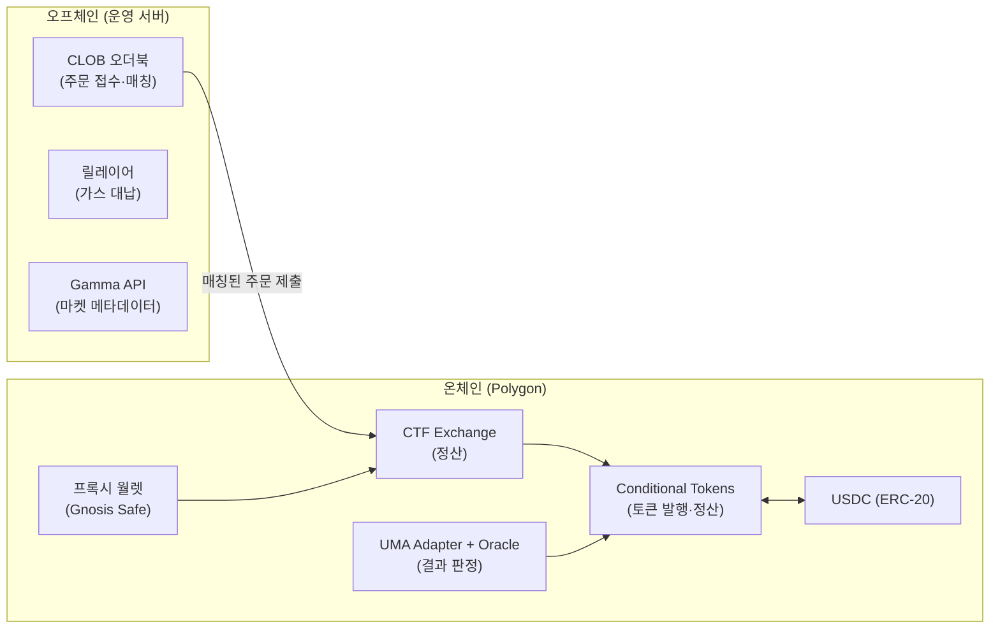
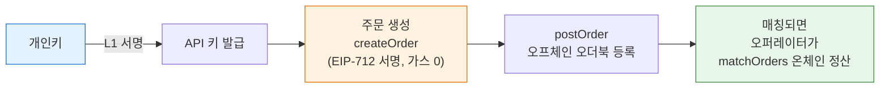

# 📒 Part 6. 폴리마켓 기능 총정리 & 기술 표준 레퍼런스

> 폴리마켓을 구성하는 **모든 기능(함수)을 컨트랙트별로 리스트업**하고,
> 거기에 쓰이는 **언어·표준(EIP/ERC)·인프라**를 한눈에 보는 레퍼런스입니다.
> 개념 설명은 [Part 2](02-polymarket-mechanics.md), [Part 3](03-ctf-exchange.md)를 보세요. 여기는 "목록표"입니다.

---

## 6-1. 전체 구조 한눈에 보기

폴리마켓은 크게 **온체인(스마트 컨트랙트)** 과 **오프체인(서버 인프라)** 으로 나뉩니다.



| 영역 | 역할 | 언어/기술 |
|------|------|-----------|
| 스마트 컨트랙트 | 토큰 발행·거래 정산·결과 판정·정산 | **Solidity** (Polygon PoS) |
| CLOB 운영 서버 | 주문 접수·매칭 (오프체인) | 비공개 백엔드 (REST + WebSocket API 제공) |
| 클라이언트 SDK | 주문 생성·서명·제출 | **TypeScript** (`@polymarket/clob-client`), **Python** (`py-clob-client`) |
| 인덱싱/데이터 | 거래 내역·포지션 조회 | **GraphQL** (The Graph 서브그래프), REST (Data API) |

---

## 6-2. 기능 리스트 ① — CTF (Conditional Tokens Framework)

> Gnosis가 만든 조건부 토큰 컨트랙트. **ERC-1155** 기반.
> "달러를 Yes/No 토큰으로 바꾸고, 다시 달러로 되돌리는" 핵심 공장입니다.

| 기능 | 함수 | 하는 일 | 누가 호출 |
|------|------|---------|-----------|
| **조건(시장) 생성** | `prepareCondition(oracle, questionId, outcomeSlotCount)` | "이 질문의 결과는 N개이고, 판정자는 이 오라클"이라고 등록 | UMA Adapter (시장 만들 때) |
| **포지션 분할 (발행)** | `splitPosition(...)` | 1 USDC → Yes 1개 + No 1개 발행 | 사용자 / Exchange (MINT 정산) |
| **포지션 병합 (소각)** | `mergePositions(...)` | Yes 1개 + No 1개 → 1 USDC 환급 | 사용자 / Exchange (MERGE 정산) |
| **결과 보고** | `reportPayouts(questionId, payouts)` | 오라클이 "Yes 승 = [1,0]" 식으로 결과 기록 | UMA Adapter만 |
| **정산 (상환)** | `redeemPositions(...)` | 판정 후, 이긴 토큰을 USDC로 교환 | 사용자 |
| 잔액·전송 | `balanceOf`, `safeTransferFrom`, `setApprovalForAll` | ERC-1155 표준 기능 | 누구나 |

**적용 표준:** ERC-1155 (멀티 토큰), `positionId = keccak256(collateral, collectionId)` 방식의 결정적 토큰 ID

---

## 6-3. 기능 리스트 ② — CTF Exchange (거래 정산 컨트랙트)

> 오프체인 CLOB이 매칭한 주문을 **온체인에서 최종 정산**하는 컨트랙트.

| 기능 | 함수 | 하는 일 | 누가 호출 |
|------|------|---------|-----------|
| **주문 체결 (단건)** | `fillOrder(order, fillAmount)` | 서명된 주문 1건을 오퍼레이터 물량과 체결 | 오퍼레이터 |
| **주문 체결 (다건)** | `fillOrders(orders[], fillAmounts[])` | 여러 주문 일괄 체결 | 오퍼레이터 |
| **주문 매칭** | `matchOrders(takerOrder, makerOrders[], ...)` | 테이커 1건 ↔ 메이커 여러 건 교차 정산 ⭐ 핵심 | 오퍼레이터 |
| **주문 취소** | `cancelOrder(order)` / `cancelOrders(orders[])` | 본인 주문을 온체인에서 무효화 | 주문 작성자 |
| **논스 증가** | `incrementNonce()` | 내 기존 서명 주문 전부 일괄 무효화 | 사용자 |
| **토큰 등록** | `registerToken(token0, token1, conditionId)` | 거래 가능한 Yes/No 토큰 쌍 등록 | 관리자 |
| 운영 제어 | `pauseTrading` / `unpauseTrading`, 오퍼레이터·관리자 추가/제거 | 긴급 정지, 권한 관리 | 관리자 |

**정산 3방식 복습** (자세히는 [3-5](03-ctf-exchange.md)):

| 방식 | 상황 | 내부 동작 |
|------|------|-----------|
| COMPLEMENTARY (NORMAL) | Yes 사는 사람 ↔ Yes 파는 사람 | 토큰 ↔ USDC 단순 교환 |
| MINT | Yes 사는 사람 ↔ No 사는 사람 | 양쪽 USDC 모아 `splitPosition`으로 새 토큰 발행 |
| MERGE | Yes 파는 사람 ↔ No 파는 사람 | 양쪽 토큰 모아 `mergePositions`로 USDC 환급 |

**적용 표준:** EIP-712 (주문 서명), EIP-1271 (컨트랙트 지갑 서명 검증), ERC-1155 수신(`onERC1155Received`)

---

## 6-4. 기능 리스트 ③ — 결과 판정 (UMA Adapter + Optimistic Oracle)

> "누가 이겼는지"를 정하는 파이프라인. UMA가 뭔지는 [2-G](02-polymarket-mechanics.md) 참고.

| 단계 | 기능/함수 | 하는 일 | 어디서 |
|------|-----------|---------|--------|
| **질문 등록 (시장 생성)** | `UmaCtfAdapter.initialize(ancillaryData, ...)` | 질문 텍스트·보상·본드 설정 → CTF에 `prepareCondition` 호출 | Polygon |
| **답 제안** | OO `proposePrice(...)` | 누구든 본드(담보) 걸고 "정답은 Yes" 제안 | Polygon |
| **이의 제기** | OO `disputePrice(...)` | 틀렸다고 생각하면 본드 걸고 반박 | Polygon |
| **분쟁 투표** | UMA DVM 투표 | UMA 토큰 홀더가 진짜 정답 투표 | **이더리움 메인넷** |
| **최종 확정** | OO `settle(...)` | 무이의 통과 or 투표 결과로 답 확정 | Polygon |
| **결과 전달** | `UmaCtfAdapter.resolve(questionId)` | 확정된 답을 CTF `reportPayouts`로 기록 | Polygon |
| 긴급 처리 | `flag` / `emergencyResolve` | 운영자가 문제 시장을 수동 판정 | Polygon |

---

## 6-5. 기능 리스트 ④ — 다중 결과 시장 (NegRisk)

> "대선 후보 5명 중 1명만 당선" 같은 **여러 결과 중 하나만 참**인 시장 전용.

| 기능 | 컨트랙트/함수 | 하는 일 |
|------|---------------|---------|
| 다중 시장 묶기 | `NegRiskAdapter` — 마켓·질문 등록 | 후보별 Yes/No 시장들을 한 그룹으로 관리 |
| **No 묶음 변환** | `convertPositions(marketId, indexSet, amount)` | "A의 No + B의 No + ..." 묶음 → USDC + 나머지 Yes로 변환 (자본 효율 ↑) |
| 전용 거래소 | `NegRiskCtfExchange` | NegRisk 토큰용 CTF Exchange (기능 동일) |
| 운영 | `NegRiskOperator` | 질문 등록·결과 전달 중계 |

---

## 6-6. 기능 리스트 ⑤ — 지갑·입출금·가스리스

| 기능 | 구현 | 하는 일 |
|------|------|---------|
| **프록시 월렛 생성** | Gnosis Safe (1/1) 또는 Polymarket Proxy Factory | 유저마다 컨트랙트 지갑 자동 배포 (이메일 가입자 포함) |
| **가스리스 거래** | 릴레이어(Relayer)가 메타 트랜잭션 대납 | 유저는 서명만, 가스비는 운영자가 지불 |
| **입금** | 이더리움 → Polygon 브릿지, 또는 Polygon USDC 직접 전송 | 거래 자금 준비 |
| **승인** | USDC `approve`, CTF `setApprovalForAll` | Exchange가 내 자산을 정산에 쓰도록 허용 |
| **출금** | 프록시 월렛 → 외부 지갑 전송, 브릿지 반환 | 자금 회수 |

---

## 6-7. 기능 리스트 ⑥ — 오프체인 API (CLOB / Gamma / Data)

> 주문 접수와 매칭은 속도 때문에 **오프체인 서버**에서 합니다. ([2-F](02-polymarket-mechanics.md) 참고)

| API | 주요 기능 | 프로토콜 |
|-----|-----------|----------|
| **CLOB API** | 주문 생성·제출·취소, 오더북 조회, 체결 내역, API 키 발급(L1/L2 인증) | REST + **WebSocket** (실시간 오더북/체결 스트림) |
| **Gamma API** | 마켓 목록·메타데이터(질문, 마감일, 카테고리) 조회 | REST |
| **Data API** | 포지션·보유량·거래 히스토리 조회 | REST |
| **서브그래프** | 온체인 이벤트 인덱싱 (체결, split/merge/redeem) | **GraphQL** (The Graph) |

**클라이언트 SDK:**

| SDK | 언어 | 용도 |
|-----|------|------|
| `@polymarket/clob-client` | TypeScript | 주문 생성 → EIP-712 서명 → 제출 |
| `py-clob-client` | Python | 동일 (봇·퀀트 트레이딩에 많이 사용) |
| `ethers.js` / `web3.py` | TS / Python | 컨트랙트 직접 호출 (redeem 등) |

**인증 체계:** L1 = 지갑 개인키 서명(EIP-712) → API 키 발급, L2 = API 키(HMAC)로 주문 API 호출

---

## 6-8. 사용 언어 & 표준 총정리 ⭐

### 언어

| 언어 | 어디에 | 비고 |
|------|--------|------|
| **Solidity** | 모든 스마트 컨트랙트 (CTF, Exchange, Adapter, NegRisk) | 0.8.x 계열, Foundry/Hardhat으로 개발·테스트 |
| **TypeScript** | 공식 CLOB 클라이언트, 프론트엔드 | |
| **Python** | 공식 CLOB 클라이언트 (트레이딩 봇 생태계) | |
| **GraphQL** | 서브그래프 쿼리 언어 | The Graph 인덱싱 |

### 토큰/컨트랙트 표준 (ERC)

| 표준 | 무엇 | 폴리마켓에서의 쓰임 |
|------|------|---------------------|
| **ERC-20** | 대체 가능 토큰 | USDC (담보 자산) |
| **ERC-1155** | 멀티 토큰 (한 컨트랙트에 여러 토큰) | Yes/No 결과 토큰 — 시장마다 토큰 ID만 다름 |
| ERC-721 | NFT | ❌ 사용 안 함 (1155와 비교용으로만 알아두기) |

### 서명/트랜잭션 표준 (EIP)

| 표준 | 무엇 | 폴리마켓에서의 쓰임 |
|------|------|---------------------|
| **EIP-712** | 구조화 데이터 서명 (사람이 읽을 수 있는 서명) | 주문(Order) 서명 — 가스 없이 주문 의사 표현 |
| **EIP-1271** | 컨트랙트 지갑의 서명 검증 표준 | Gnosis Safe/프록시 월렛 유저의 주문 검증 |
| EIP-2612 (permit) | 서명만으로 ERC-20 승인 | USDC 가스리스 승인에 활용 |
| 메타 트랜잭션 | 제3자가 가스 대납 | 릴레이어 기반 가스리스 UX |

### 인프라 표준/프로토콜

| 기술 | 쓰임 |
|------|------|
| **Polygon PoS** | 모든 컨트랙트 배포 체인 (낮은 가스비) |
| **UMA Optimistic Oracle** | 결과 판정 (제안→이의→투표) |
| **Gnosis Safe** | 유저 프록시 월렛 |
| **The Graph** | 온체인 데이터 인덱싱 |
| REST / WebSocket / JSON-RPC | API 통신 / 노드 통신 |

---

## 6-9. 시장의 일생으로 기능 다시 보기 (요약 흐름)

```
[시장 생성]  UmaCtfAdapter.initialize → CTF.prepareCondition → Exchange.registerToken
     ↓
[토큰 발행]  splitPosition (USDC → Yes+No)        ← 사용자 or MINT 정산
     ↓
[거래]       CLOB API 주문(EIP-712 서명) → matchOrders 온체인 정산
     ↓                                    (NORMAL / MINT / MERGE)
[결과 판정]  UMA: propose → (dispute → DVM 투표) → settle → resolve → reportPayouts
     ↓
[정산]       redeemPositions (이긴 토큰 → USDC)
     ↓
[청산 끝]    mergePositions는 판정 전 언제든 가능 (Yes+No → USDC)
```

---

## 6-10. 오더북은 어떻게 작동하나 (엔진·WebSocket·가격 형성)

> 폴리마켓의 CLOB도 결국 **주식시장 오더북과 같은 원리**예요. "어떤 기술로 만드는가"와 "가격이 어떻게 정해지는가"를 정리합니다.

### ① 오더북은 두 부분으로 나뉜다 — 엔진 vs 전달 통로

오더북을 만든다고 하면 흔히 WebSocket을 떠올리지만, **핵심 두뇌(매칭 엔진)와 전달 통로는 다른 기술**입니다.

| 부분 | 역할 | 쓰는 기술 |
|------|------|-----------|
| **매칭 엔진** | 주문을 짝지어 체결 (핵심 두뇌) | **C++ / Rust / Java** + **In-memory 자료구조** (DB 안 거침) |
| 주문 정렬 | 가격별로 줄 세우기 | 정렬 트리 (Red-Black Tree / Skip List) + 가격-시간 우선순위 |
| 주문 넣기·취소 | 요청-응답 | **REST** (또는 기관용 **FIX**) |
| **실시간 시세 전달** | 서버 → 화면 푸시 | **WebSocket** ⭐ |

> 💡 **비유:** 매칭 엔진은 "경매사"예요. 호가를 머릿속(메모리)에서 즉시 정렬·체결합니다. 종이(DB)에 적었다 지웠다 하면 느려서, 머리로 처리하고 결과만 기록해요. **WebSocket은 그 결과를 객석(화면)에 실시간 중계하는 마이크**고요.

**왜 WebSocket?** 일반 HTTP는 "물어봐야 답함"(요청-응답). 오더북은 0.01초마다 바뀌니, 연결을 열어두고 **서버가 바뀔 때마다 알아서 밀어주는** WebSocket이 실시간 시세에 맞아요. → 폴리마켓 CLOB API도 **REST(주문) + WebSocket(실시간 오더북)** 조합 ([6-7](#6-7-기능-리스트--오프체인-api-clob--gamma--data) 참고)

**오더북 자료구조 모양:**
```
매도(파는 사람) ───────────
  $0.65 → [주문 A: 100개, 주문 B: 50개]   ← 가격별 칸 + 같은 가격은
  $0.64 → [주문 C: 200개]                    먼저 온 주문이 먼저 체결
  ─────────  ← 스프레드(빈 공간)            (Price-Time Priority)
매수(사는 사람)
  $0.63 → [주문 D: 80개]
  $0.62 → [주문 E: 300개]
```

### ② 현재가는 "정해진 값"이 아니라 "가장 최근 체결가"

> ❌ 현재가 = 누군가 정한 값
> ✅ **현재가 = 방금 실제로 사고팔린 가격** (거래될 때마다 갱신)

평소엔 매도 최저(Ask)와 매수 최고(Bid) 사이에 **빈 공간(스프레드)** 이 있어 거래가 안 일어나요. 누군가 그 간격을 넘어 주문하면 체결되고, **그 체결가가 곧 현재가**가 됩니다. 가격을 움직이는 힘은 결국 **수요와 공급**이에요.

### ③ 내가 부른 가격 = "상한선", 실제 체결 = "걸려있던 매물 가격"

가장 헷갈리는 부분. **0.70 매물이 있는데 내가 0.71에 사면 → 0.71이 아니라 0.70에 체결**됩니다.

```
매도 $0.70 매물이 걸려있음 + 내가 "0.71까지 OK" 매수
→ 엔진: "0.70에 파는 사람이 있으니 더 싼 0.70에 사면 됨"
→ 체결가 = $0.70 (남는 1센트는 내 이득 = 가격 개선)
```

내가 부른 0.71은 **"최대 지불 의사(상한선)"** 일 뿐이에요. **현재가가 0.71로 오르는 건, 0.70 매물을 다 소진하고 다음 호가(0.71)로 넘어갈 때**입니다.

| 주문 종류 | 의미 | 체결 |
|-----------|------|------|
| **지정가(Limit) "0.71까지"** | 상한선만 지정 | 0.70 매물 있으면 **0.70에** (유리하게) |
| **시장가(Market) "그냥 사줘"** | 가격 안 따짐 | 싼 것부터 **있는 대로 쓸어담음** (슬리피지) |

### ④ 메이커 vs 테이커 — "기다리는 쪽 vs 덮치는 쪽"

매수/매도냐가 아니라, **맞는 상대가 이미 있느냐**가 기준이에요.

```
주문이 들어옴
 ├─ 맞는 상대가 오더북에 있다  → 즉시 체결 = 테이커(덮침)
 └─ 맞는 상대가 없다          → 오더북에 등록·노출 = 메이커(기다림)
```

| 상황 | 메이커(기다림) | 테이커(덮침) |
|------|---------------|-------------|
| 매도 $0.70 먼저 + 매수가 옴 | 매도 | 매수가 사버림 |
| 매수 $0.70 먼저 + 매도가 옴 | 매수 | 매도가 팔아버림 |

> 💡 **매수도 등록되고, 매도도 덮칠 수 있어요.** "매도=등록, 매수=체결"은 매도가 먼저 와 있던 한 사례일 뿐. 그래서 거래소는 **유동성을 깔아준 메이커에겐 수수료를 깎아주고, 소모하는 테이커에겐 더 받습니다.** (폴리마켓 [Part 3](03-ctf-exchange.md)의 메이커·테이커가 이것)

### ⑤ 폴리마켓도 똑같다

폴리마켓의 **"가격 = 확률"** 도 이 원리예요. Yes가 $0.65에 체결 = "시장이 보는 확률 65%". 엔진·WebSocket·가격 형성 원리 전부 주식시장과 동일하고, **차이는 정산을 스마트 컨트랙트가 한다**는 것뿐입니다. ([Part 2-D](02-polymarket-mechanics.md), [Part 2-E](02-polymarket-mechanics.md) 참고)

---

## 6-11. USDC 멀티체인 정리 (어느 체인에서 쓸 수 있나)

> 폴리마켓의 담보 화폐 USDC는 **여러 블록체인에 동시에 존재**해요. 단, 같은 "USDC"라도 **체인마다 별개**라서 그냥 옮겨지지 않습니다.

### ⭐ 먼저: 네이티브 USDC vs 브릿지 USDC

| 구분 | 뜻 | 표기 |
|------|-----|------|
| **네이티브 USDC** | 발행사 **Circle이 그 체인에 직접 찍은** 진짜 USDC (실제 달러 100% 담보) | `USDC` |
| **브릿지 USDC** | 다른 체인 USDC를 다리로 옮긴 복제본 (Circle 직접 발행 X) | `USDC.e` |

> 💡 폴리마켓은 **Polygon의 네이티브 USDC**를 씁니다. (예전엔 브릿지 USDC.e → Circle이 직접 발행 시작하며 네이티브로 전환)

### 지원 블록체인 (네이티브 발행 기준)

| 분류 | 체인 |
|------|------|
| **🟦 L1 (독립 메인넷)** | Ethereum(원조), Solana, Avalanche, Stellar, Algorand, Hedera, NEAR, Aptos, Sui, XRP Ledger, Flow, Noble(Cosmos 허브), Polkadot |
| **🟩 L2 (이더리움 롤업)** | Arbitrum, Base, OP Mainnet(Optimism), zkSync Era, Linea, Unichain, World Chain |
| **🟨 사이드체인/커밋체인** | **Polygon PoS** ⭐ (폴리마켓이 쓰는 체인) |
| **⚪ 지원 중단** | Tron (Circle이 2024-02 네이티브 발행 중단) |

> ⚠️ Circle은 신규 체인을 자주 추가해요. 최신 목록은 **[circle.com/multi-chain-usdc](https://www.circle.com/multi-chain-usdc)** 에서 확인하세요. (위 표는 2026년 초 기준)

### "USDC 개발 = Solidity?" → 체인마다 다름

USDC는 **그 체인이 쓰는 언어/표준**으로 각각 구현됩니다. Solidity 전용이 아니에요.

| 체인 종류 | 토큰 표준 | 언어 |
|-----------|-----------|------|
| **EVM 계열** (Ethereum, Polygon, Arbitrum, Base, Avalanche, Optimism…) | ERC-20 | **Solidity** ✅ |
| Solana | SPL Token | **Rust** |
| Aptos / Sui | Move 표준 | **Move** |
| NEAR | NEP-141 | **Rust** |
| Stellar | 네이티브 자산 | (계약 언어 불필요) |
| Algorand | ASA | TEAL/PyTeal |
| Flow | — | **Cadence** |

> ⭐ **폴리마켓 관점:** Polygon은 **EVM 체인**이므로 거기 USDC는 **Solidity로 짠 ERC-20**이에요. ([6-8](#6-8-사용-언어--표준-총정리-)에서 "USDC = ERC-20"이라 한 이유). 단, 이는 **EVM 한정**이고 USDC 자체가 Solidity 전용은 아닙니다.

### 체인 간 USDC 이동

같은 USDC라도 체인이 다르면 **그냥 못 보내요.** 옮기려면:

| 방법 | 설명 |
|------|------|
| **브릿지(Bridge)** | 한쪽에 잠그고 반대쪽에 복제본 발행 (USDC.e가 이렇게 생김) |
| **CCTP** (Cross-Chain Transfer Protocol) | Circle 공식 프로토콜. 원본을 **소각(burn) → 목적지에 네이티브 발행(mint)**. 복제본이 아닌 진짜 USDC로 이동 ⭐ |

---

## 6-12. Circle Arc 생태계 (USDC 발행사가 만든 자체 L1)

> **Arc(아크)** 는 USDC 발행사 **Circle이 직접 만든 Layer-1 블록체인**이에요.
> 지금까지 본 Polygon·이더리움이 "남의 체인을 빌려 쓴" 거라면, Arc는 **"USDC를 위한, USDC에 의한 체인"** — 한마디로 스테이블코인 금융에 특화된 독자 네트워크입니다.

### 핵심 특징 (개발자 관점)

| 특징 | 내용 | 왜 중요한가 |
|------|------|------------|
| **USDC가 네이티브 가스** | 가스비를 ETH/POL이 아닌 **USDC(달러)로 지불** | 가스비가 "달러로 예측 가능". 변동성 코인을 따로 챙길 필요 없음 ⭐ |
| **EVM 호환** | Solidity·Hardhat·Foundry 등 **기존 이더리움 도구 그대로** | 폴리마켓 Solidity 지식을 거의 그대로 재사용 가능 |
| **즉시 완결성** | Malachite 합의 엔진, **1초 미만 deterministic finality** | 결제·정산용으로 빠름 |
| **선택적 프라이버시** | 잔액·거래를 선택적으로 가림 | 기관용 요구 충족 |
| **내장 FX 엔진** | 스테이블코인 간 환전(USDC↔EURC 등)을 프로토콜 레벨에서 | 외환 결제 특화 |
| **포스트 양자 암호** | 메인넷부터 양자내성 암호 적용 예정 | 장기 보안 |

### 현재 상태 ⚠️

| 시점 | 상태 |
|------|------|
| 2025-10 | **퍼블릭 테스트넷** 출시 (BlackRock·Visa·HSBC·AWS·Anthropic 등 100+ 기관 참여) |
| 2026-05 | ARC 토큰 프리세일 ($222M 모금, FDV 약 $30억) |
| **2026 (예정)** | **메인넷 출시 예정** — 양자내성 암호 탑재 |

> 🚨 **개발 시작 전 필독:** Arc는 (이 문서 기준) **테스트넷 단계**일 수 있어요. 실제 USDC 자금이 오가는 메인넷 출시 여부를 **반드시 [circle.com](https://www.circle.com)·[arc.io](https://www.arc.io)에서 확인**하고 시작하세요.

### "Arc에서 개발하면?" → Solidity 그대로

Arc는 **EVM 호환**이라 [6-8](#6-8-사용-언어--표준-총정리-)의 스택이 그대로 통합니다.

| 항목 | Polygon (폴리마켓) | Circle Arc |
|------|--------------------|------------|
| 언어 | Solidity | **Solidity (동일)** |
| 표준 | ERC-20 / ERC-1155 / EIP-712 | **동일** |
| 도구 | Foundry / Hardhat / ethers.js | **동일** |
| **가스비 지불** | POL(네이티브 토큰) | **USDC** ⭐ 결정적 차이 |
| 위상 | 사이드체인 (남의 체인) | Circle 소유 L1 |

> 💡 **폴리마켓류 앱을 Arc에 올린다면?** Polygon에서 하던 Solidity 개발과 거의 똑같아요. 가장 큰 차이는 **"가스용 POL을 따로 챙길 필요가 없다"** — 가스도 USDC로 내니까요. 예측시장처럼 **USDC가 중심인 앱엔 오히려 더 잘 맞는** 환경입니다.

### 한 줄 요약

> **Circle Arc = USDC가 가스인 EVM 호환 L1.** Solidity 지식은 그대로 쓰되, 가스비를 달러(USDC)로 낸다는 점만 다르다. (2026년 메인넷 출시 예정 — 시작 전 상태 확인 필수)

---

## 6-13. CLOB로 주문 넣기 — 실전 코드 (py-clob-client / TS)

> [6-7](#6-7-기능-리스트--오프체인-api-clob--gamma--data)에서 본 CLOB API를 **실제로 호출**하는 최소 예제예요.
> [Part 4-9](04-build-roadmap.md#4-9--프론트엔드-실전-코드-phase-3-상세--wagmi--viem)가 컨트랙트 직접 호출이었다면, 여기는 **폴리마켓식 오더북 주문**입니다.
> ⚠️ **API는 자주 바뀌어요.** 실제 파라미터·엔드포인트는 반드시 [docs.polymarket.com](https://docs.polymarket.com)에서 대조하세요.

### 인증 2단계 복습 ([6-7](#6-7-기능-리스트--오프체인-api-clob--gamma--data))

```
L1 (지갑 개인키 EIP-712 서명)  →  API 키 발급/유도
L2 (발급받은 API 키)           →  주문 API 호출
```

### 🐍 Python — `py-clob-client`

```bash
pip install py-clob-client
```

```python
from py_clob_client.client import ClobClient
from py_clob_client.clob_types import OrderArgs, OrderType
from py_clob_client.order_builder.constants import BUY

HOST = "https://clob.polymarket.com"
CHAIN_ID = 137              # Polygon
PRIVATE_KEY = "0x..."       # 절대 하드코딩 X — 환경변수로!

# 1) 클라이언트 생성 (L1: 지갑 서명)
client = ClobClient(HOST, key=PRIVATE_KEY, chain_id=CHAIN_ID)

# 2) API 키 발급/유도 후 장착 (L2)
client.set_api_creds(client.create_or_derive_api_creds())

# 3) 주문 만들기 — "Yes 토큰을 0.55에 100개 매수"
order_args = OrderArgs(
    token_id="71321045679252212594626385532706912750332728571942532289631379312455583992563",  # Yes/No 결과 토큰 ID
    price=0.55,             # 가격 = 확률 (0~1)
    size=100.0,             # 수량
    side=BUY,               # BUY=매수(USDC→토큰), SELL=매도
)
signed = client.create_order(order_args)   # EIP-712 서명 (가스 0)

# 4) 오더북에 제출 (GTC = 취소 전까지 유효)
resp = client.post_order(signed, OrderType.GTC)
print(resp)
```

### 🟦 TypeScript — `@polymarket/clob-client`

```bash
npm install @polymarket/clob-client ethers
```

```ts
import { ClobClient, Side, OrderType } from '@polymarket/clob-client';
import { ethers } from 'ethers';

const HOST = 'https://clob.polymarket.com';
const CHAIN_ID = 137; // Polygon

async function placeOrder() {
  const wallet = new ethers.Wallet(process.env.PRIVATE_KEY!); // 환경변수 사용

  // 1) L1 클라이언트 → API 키 발급/유도
  const l1 = new ClobClient(HOST, CHAIN_ID, wallet);
  const creds = await l1.createOrDeriveApiKey();

  // 2) L2 클라이언트 (API 키 장착)
  const client = new ClobClient(HOST, CHAIN_ID, wallet, creds);

  // 3) 주문 생성 → EIP-712 서명 (가스 0)
  const order = await client.createOrder({
    tokenID: '7132104567925221259462638553270691275033272857...', // 결과 토큰 ID
    price: 0.55,
    side: Side.BUY,
    size: 100,
  });

  // 4) 제출 (GTC)
  const resp = await client.postOrder(order, OrderType.GTC);
  console.log(resp);
}
```

### 무슨 일이 일어나나 (흐름)



> 💡 핵심은 **`createOrder`까지는 전부 오프체인 서명(가스 0)** 이고, 온체인 정산은 매칭된 뒤 오퍼레이터가 대신 한다는 것 ([Part 3-4](03-ctf-exchange.md), [Part 2-F](02-polymarket-mechanics.md)). `token_id`는 거래할 Yes/No의 ERC-1155 ID로, Gamma API나 마켓 페이지에서 얻어요.

> 🔐 **보안:** 개인키는 **환경변수**(`os.environ` / `process.env`)로 주입하고, 코드·Git에 **절대 하드코딩 금지**. (봇 운영 시 별도 지갑 권장)

---

*Last updated: 2026-06-10*
